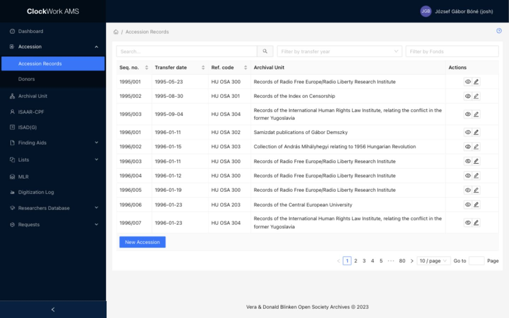
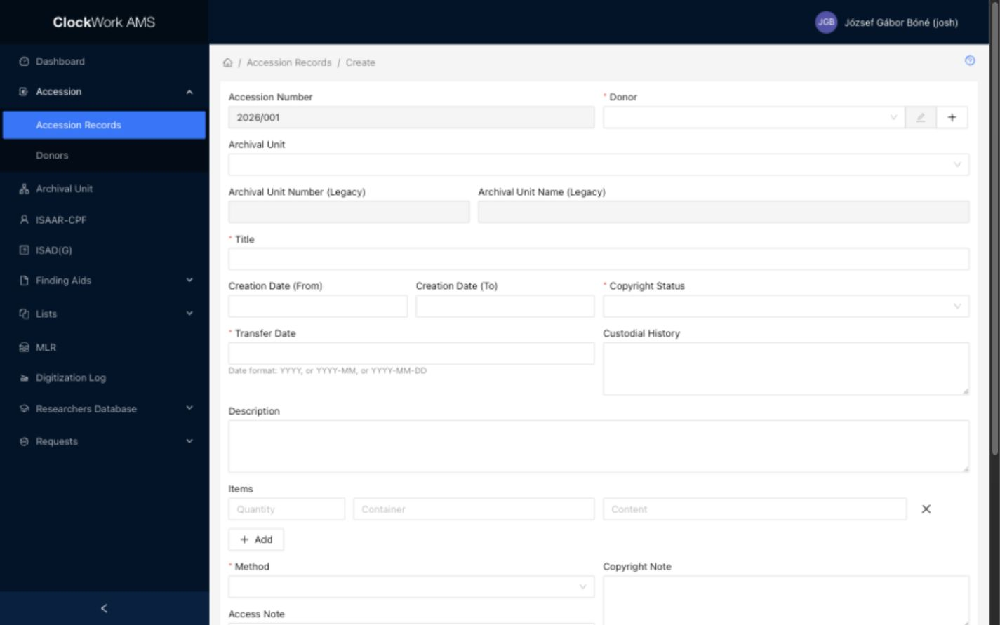
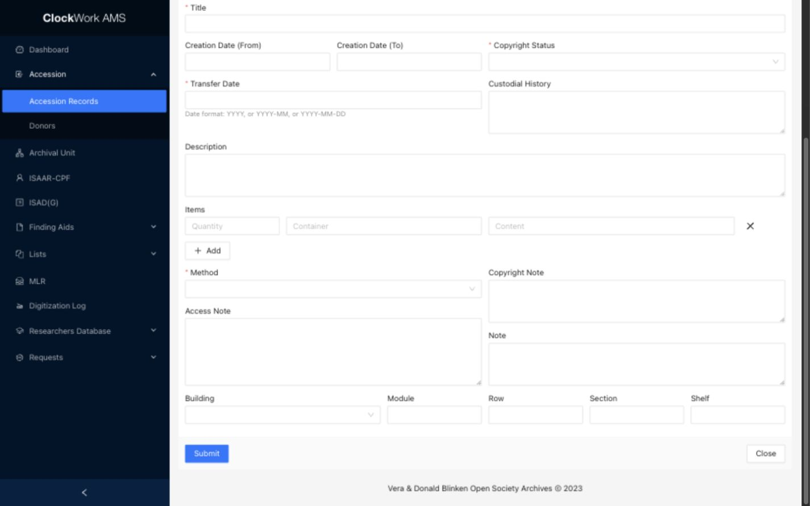

# Accession records

Accession records document incoming material, its source, rights, initial description, and initial storage information. Access requires membership in the **Accessions** group.

## Accession Records List

*The Accession Records list provides search, transfer-year and fonds filters, row actions, and the New Accession button.*

### Filters

Filters appear above the table and limit the records displayed.

| Filter | Description |
|---|---|
| Search | Enter a free-text query to find matching accession records. Clear the field to restore the unfiltered list. |
| Filter by transfer year | Select a year from 1995 through the current year to show accessions transferred in that year. |
| Filter by Fonds | Enter a fonds value to restrict the list to accessions associated with that fonds. |

Filters can be combined. If an expected accession is missing, clear one or more filters and search again.

### Columns

| Column | Description | Sortable |
|---|---|---|
| Seq. no. | The accession sequence number assigned by AMS. | Yes |
| Transfer date | The recorded date on which the material was transferred. | Yes |
| Ref. code | The reference code of the linked target fonds. For legacy records without a linked Archival Unit, AMS displays `HU OSA` followed by the legacy Archival Unit number. | Yes |
| Archival Unit | The title recorded for the accessioned material. | No |
| Actions | Buttons for operations available on the row. | No |

Select a sortable column heading to change the table order.

### Row actions

| Action | Description | Effect |
|---|---|---|
|  **View** | Opens the Accession Form in read-only mode. | Does not change the record. |
|  **Edit** | Opens the Accession Form with editable fields. | The record changes only after **Submit** is selected. |
|  **Delete** | Opens a confirmation dialog for a record that AMS allows to be removed. | Confirming permanently deletes the accession record. |

The Delete button is shown only when the record is marked as removable. Because deletion can remove transfer history needed to understand the provenance and management of material, verify the accession and its relationships before confirming.

### Footer action

**New Accession** opens the Accession Form in Create mode. Opening the form does not create the record; the new accession is created when the completed form is submitted successfully.

## Accession Form

The Accession Form is used to view, create, and edit accession records. The available controls depend on how you opened it.

### Before opening the form

#### Target fonds

!!! warning "A target fonds is required"
    You cannot create an accession record without a target archival fonds. Before starting the accession, confirm that the fonds already exists under **Archival Unit**. If it does not exist, create the fonds first.

The fonds provides the archival destination for the incoming material and links the accession to the correct archival hierarchy. A subfonds or series may be added later when required, but at least the target fonds must exist before the accession is created.

To prepare the target fonds:

1. Open **Archival Unit**.
2. Search for the intended fonds and confirm that it is the correct Archival Unit.
3. If it does not exist, create a new fonds and save it.
4. Return to **Accession → Accession Records**.

#### Donor

The donor must also exist before you create the accession. Search [Donor Records](donor-records.md) and create the donor if necessary.

*The Accession Form in Create mode. Required fields are marked with an asterisk; selecting the target fonds is also a required part of the accession workflow.*

| Mode | Field behavior | Available actions |
|---|---|---|
| View | Record fields are read-only. | **Close** and **Show Info** |
| Create | Editable fields accept a new accession. System-managed fields remain disabled. | **Submit** and **Close** |
| Edit | Editable fields contain the current record values. System-managed fields remain disabled. | **Submit**, **Close**, and **Show Info** |

**Show Info** displays creation and update information and the record's audit log. **Close** returns to the Accession Records list without submitting the form.

### Fields

| Field | Requirement | Input or source | Guidance |
|---|---|---|---|
| Accession Number | System assigned | Read-only | The accession's sequence number. AMS assigns and displays this value; it cannot be entered or changed in the form. |
| Donor | Required | [Select with Add and Edit](../getting-started/special-form-fields.md#select-with-add-and-edit) using Donor Records | Select the person or organization transferring the material. Search for an existing donor, use the pencil to edit the selected donor, or use the plus button to create one in a drawer. A donor saved in the drawer remains saved even if you close the accession form. |
| Archival Unit | Required | [Select field](../getting-started/special-form-fields.md#select-fields) using fonds-level Archival Units | Select the target fonds. The selector is restricted to Archival Units at fonds level; create the fonds before starting the accession. |
| Archival Unit Number (Legacy) | System managed | Read-only | Preserves a legacy Archival Unit number on migrated or historical records. It cannot be entered or changed here. |
| Archival Unit Name (Legacy) | System managed | Read-only | Preserves a legacy Archival Unit name on migrated or historical records. It cannot be entered or changed here. |
| Title | Required | Text | Enter a concise title that identifies the accessioned material. |
| Creation Date (From) | Optional | [Partial-date text](../getting-started/special-form-fields.md#date-fields) | Enter the beginning of the material's creation-date range according to the institution's date-entry rules. |
| Creation Date (To) | Optional | [Partial-date text](../getting-started/special-form-fields.md#date-fields) | Enter the end of the creation-date range. Leave it empty when an end date is not applicable or not known. |
| Copyright Status | Required | Accession copyright-status list | Select the status that applies to the accession. Use **Copyright Note** for necessary explanation or qualification. |
| Transfer Date | Required | [Partial-date text](../getting-started/special-form-fields.md#date-fields) | Enter the date of transfer as `YYYY`, `YYYY-MM`, or `YYYY-MM-DD`, using the most precise known value. |
| Custodial History | Optional | Multiline text | Describe the custody and ownership of the material before its transfer to the archives. |
| Description | Optional | Multiline text | Summarize the content, scope, or character of the incoming material. This field is included in Dashboard full-text search. |
| Items | Optional, repeatable | [Repeatable field group](../getting-started/special-form-fields.md#repeatable-field-groups-and-subforms) | Add one row for each distinct group of material that should be recorded within the accession. Each row contains **Quantity**, **Container**, and **Content**. |
| Method | Required | Accession-method list | Select the method by which the archives acquired the material. |
| Access Note | Optional | Multiline text | Record access conditions or information needed when later assessing access to the material. |
| Copyright Note | Optional | Multiline text | Explain or qualify the selected copyright status. |
| Note | Optional | Multiline text | Record other accession information that does not belong in a more specific field. |
| Building | Optional | [Select field](../getting-started/special-form-fields.md#select-fields) using the Buildings controlled list | Select the building where the accession is initially stored. |
| Module | Optional | Text | Enter the storage module within the selected building. |
| Row | Optional | Text | Enter the storage row. |
| Section | Optional | Text | Enter the storage section. |
| Shelf | Optional | Text | Enter the storage shelf. |

### Item rows

| Item field | Requirement | Guidance |
|---|---|---|
| Quantity | Optional | Enter the number or amount represented by the row. Keep the unit understandable from the accompanying container or content information. |
| Container | Optional | Identify the physical container or container type associated with the item group. |
| Content | Optional | Briefly describe the material represented by the row. |

Select **Add** to append another item row. Use the remove button at the end of a row to remove that row before submitting the form. In View mode, item rows are read-only and the add/remove controls are unavailable.

*The lower part of the form contains accession items, method and notes, initial storage information, and the Submit and Close actions.*
