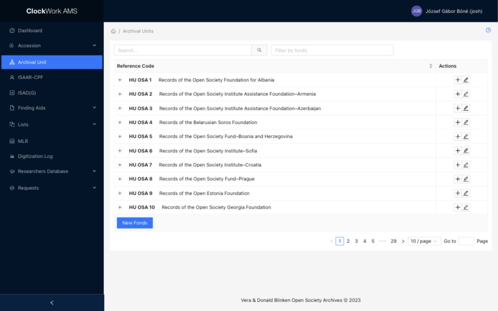

# Archival Unit

Archival Units provide the structural hierarchy used throughout AMS. Access requires the **Archival Units** group.

## Archival Unit List

*The Archival Unit list provides hierarchy controls, search and fonds filters, row actions, and the New Fonds button.*

The list initially displays Fonds-level records. Their underlying Subfonds and Series can be opened within the same table.

### Filters

Filters appear above the table and limit the records displayed.

| Filter | Description |
|---|---|
| Search | Enter a free-text query to search the titles of Fonds, their Subfonds, and their Series. The results are presented through the matching Fonds-level hierarchies. Clear the field to restore the unfiltered list. |
| Filter by fonds | Enter a Fonds number to display that Fonds and its hierarchy. |

Filters can be combined. If an expected Archival Unit is missing, clear one or both filters and search again.

### Columns

| Column | Description | Sortable |
|---|---|---|
| Hierarchy control | A plus icon at the beginning of a Fonds or Subfonds row indicates that lower levels are available. Select it to expand the row. | No |
| Reference Code | Displays the system-generated reference code followed by the Archival Unit title. | Yes |
| Actions | Buttons for operations available on the row. | No |

Select a sortable column heading to change the table order.

### Expanding the hierarchy

Select the **plus icon at the beginning of a Fonds row** to display its underlying Subfonds. Select the corresponding plus icon on a Subfonds row to display its Series. An expanded control changes to a minus icon; select it to collapse that part of the hierarchy.

Expanding or collapsing rows only changes the list display. It does not edit any Archival Unit.

!!! note "Two different plus icons"
    The plus at the beginning of a row expands the hierarchy. The plus in the **Actions** column creates a new child Archival Unit.

### Row actions

| Action | Availability | Description | Effect |
|---|---|---|---|
| Create child | Fonds and Subfonds rows | Select the plus in the **Actions** column. On a Fonds it opens a new Subfonds form; on a Subfonds it opens a new Series form. | Does not create the child until the form is submitted successfully. |
| Edit | All levels | Opens the appropriate Fonds, Subfonds, or Series form in a modal side panel. | Changes are saved when **Submit** is selected. |
| Delete | Removable records only | Opens a confirmation dialog. | Confirming permanently deletes the Archival Unit. |

A Series cannot have a child, so its Actions column has no Create child button. The Delete button is shown only when AMS marks the record as removable. Archival Units referenced by child units or other records are protected; check relationships with accessions, ISAD(G), containers, finding aids, and requests before deletion.

### Footer action

**New Fonds** opens a blank Fonds Form in a modal side panel. Opening the form does not create the Fonds; it is created when the completed form is submitted successfully.

## Archival Unit Form

The Archival Unit Form is used to create and edit Fonds, Subfonds, and Series. It opens in a modal side panel over the Archival Unit List, so the user remains on the same page.

| Mode | Field behavior | Available actions |
|---|---|---|
| Create | Accepts a new Fonds, Subfonds, or Series. When creating a child, AMS fills the parent information automatically. | **Submit** and the modal close control |
| Edit | Displays the saved values of the selected Archival Unit. Parent context and system-managed values remain read-only. | **Submit** and the modal close control |

Select **Submit** to save the form. Closing the modal before submitting discards unsaved form changes. In Edit mode, creation and update details and the audit log appear below the fields.

### Hierarchy and unique numbers

The supported hierarchy has three levels:

- **Fonds** is the top-level Archival Unit.
- **Subfonds** belongs to a Fonds.
- **Series** belongs to a Subfonds. Subfonds number `0` can represent Series arranged directly beneath a Fonds.

!!! important "Number combinations must be unique"
    Each position in the hierarchy must have a unique number combination. A Fonds number may be used only once; a Subfonds number must be unique within its Fonds; and a Series number must be unique within its Fonds and Subfonds. Search the hierarchy before creating a record and do not reuse an existing combination.

AMS generates the reference code from these numbers:

| Level | Number combination | Example reference code |
|---|---|---|
| Fonds | Fonds | `HU OSA 123` |
| Subfonds | Fonds + Subfonds | `HU OSA 123-4` |
| Series | Fonds + Subfonds + Series | `HU OSA 123-4-56` |

### Fonds fields

| Field | Requirement | Input or source | Guidance |
|---|---|---|---|
| Fonds | Required | Number from 1 to 1000 | Enter the unique Fonds number. AMS uses it to generate the reference code. |
| Title | Required | Text | Enter the title of the Fonds. |
| Acronym | Optional | Text | Enter the established short form of the Fonds title when applicable. |
| Original Title | Optional | Text | Enter the title in its original language or script when it differs from Title. |
| Original Locale | Optional | [Original Locale select](../getting-started/special-form-fields.md#original-locale-and-translated-fields) | Identify the language/locale used by Original Title. |
| Archival Unit Theme | Optional | Multiple-select field using the Archival Unit Themes controlled list | Select every theme that applies to the Fonds. |

### Subfonds fields

| Field | Requirement | Input or source | Guidance |
|---|---|---|---|
| Fonds | System supplied | Read-only | Displays the parent Fonds number. |
| Fonds Title | System supplied | Read-only | Displays the parent Fonds title for context. |
| Fonds Acronym | System supplied | Read-only | Displays the parent Fonds acronym for context. |
| Subfonds | Required | Number, minimum 0 | Enter a number that is unique within the parent Fonds. Use `0` only for the designated zero Subfonds. |
| Title | Required except for Subfonds 0 | Text | Enter the Subfonds title. An empty title is allowed only when the Subfonds number is `0`. |
| Acronym | Optional | Text | Enter the established short form of the Subfonds title when applicable. |
| Original Title | Optional | Text | Enter the title in its original language or script when it differs from Title. |
| Original Locale | Optional | [Original Locale select](../getting-started/special-form-fields.md#original-locale-and-translated-fields) | Identify the language/locale used by Original Title. |
| Archival Unit Theme | Optional | Multiple-select field using the Archival Unit Themes controlled list | Select every theme that applies to the Subfonds. |

The parent relationship is assigned automatically from the Fonds row used to open the form.

### Series fields

| Field | Requirement | Input or source | Guidance |
|---|---|---|---|
| Fonds | System supplied | Read-only | Displays the parent hierarchy's Fonds number. |
| Fonds Title | System supplied | Read-only | Displays the Fonds title for context. |
| Fonds Acronym | System supplied | Read-only | Displays the Fonds acronym for context. |
| Subfonds | System supplied | Read-only | Displays the parent Subfonds number. |
| Subfonds Title | System supplied | Read-only | Displays the Subfonds title for context. |
| Subfonds Acronym | System supplied | Read-only | Displays the Subfonds acronym for context. |
| Series | Required | Number, minimum 1 | Enter a number that is unique within the displayed Fonds and Subfonds combination. |
| Title | Required | Text | Enter the title of the Series. |
| Acronym | Optional | Text | Enter the established short form of the Series title when applicable. |
| Original Title | Optional | Text | Enter the title in its original language or script when it differs from Title. |
| Original Locale | Optional | [Original Locale select](../getting-started/special-form-fields.md#original-locale-and-translated-fields) | Identify the language/locale used by Original Title. |
| Archival Unit Theme | Optional | Multiple-select field using the Archival Unit Themes controlled list | Select every theme that applies to the Series. |

The parent relationship is assigned automatically from the Subfonds row used to open the form.

### Effects of editing an Archival Unit

- Changing a hierarchy number causes AMS to regenerate that Archival Unit's reference code and sort value when the form is submitted.
- Changing the title also updates the title in a directly linked ISAD(G) record.
- Other records that link to the Archival Unit continue to refer to the same record, but users may see its updated reference code or title elsewhere in AMS.

Verify the selected record and its relationships before changing a hierarchy number or title.
