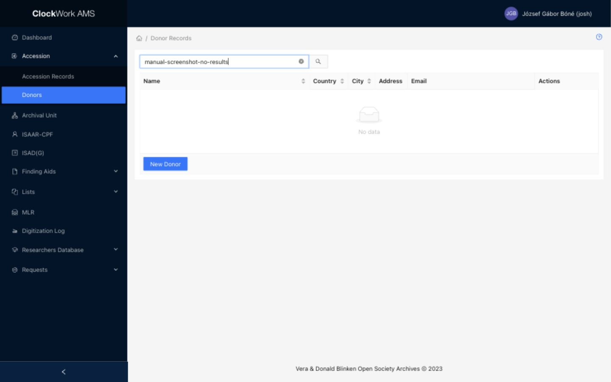

# Donor records

Donor records identify the person or organization from which material is transferred. Access requires membership in the **Accessions** group.

## Donor Records List

*The Donor Records list provides a free-text search, sortable identity and location columns, row actions, and the New Donor button.*

### Filters

The filter appears above the table and limits the records displayed.

| Filter | Description |
|---|---|
| Search | Enter a free-text query to find donors by **Name**, **Email**, or **Country**. Clear the field to restore the unfiltered list. |

Search for an existing donor before creating a new record. Reusing the correct donor keeps its accession history together and avoids duplicate records for the same person or organization.

### Columns

| Column | Description | Sortable |
|---|---|---|
| Name | The donor's system-generated display name. For a person, AMS combines the available personal-name fields; for an organization, it uses the corporation name. | Yes |
| Country | The country in the donor's postal address. | Yes |
| City | The city in the donor's postal address. | Yes |
| Address | The donor's street or delivery address. | No |
| Email | The donor's recorded email address. | No |
| Actions | Buttons for operations available on the row. | No |

Select a sortable column heading to change the table order.

### Row actions

| Action | Description | Effect |
|---|---|---|
| View | Opens the Donor Form in read-only mode. | Does not change the record. |
| Edit | Opens the Donor Form with editable fields. | The record changes only after **Submit** is selected. Changes affect every accession that links to this donor. |
| Delete | Opens a confirmation dialog for a donor that AMS allows to be removed. | Confirming permanently deletes the donor record. |

The Delete button is shown only when the donor is removable. A donor linked to an accession is protected and cannot be deleted. Before deleting an unlinked donor, verify that it is not needed as evidence of a transfer relationship.

### Footer action

**New Donor** opens the Donor Form in Create mode. Opening the form does not create a record; the new donor is created when the completed form is submitted successfully.

## Donor Form

The Donor Form is used to view, create, and edit donor records. The same form also opens in a drawer when a donor is added or edited from the [Donor field in the Accession Form](accession-records.md#fields).

| Mode | Field behavior | Available actions |
|---|---|---|
| View | Record fields are read-only. | **Close** and **Show Info** |
| Create | Editable fields accept a new donor. The system-generated Name remains disabled. | **Submit** and **Close** |
| Edit | Editable fields contain the current donor values. The system-generated Name remains disabled. | **Submit**, **Close**, and **Show Info** |

**Show Info** displays creation and update information and the record's audit log. **Close** returns to the Donor Records list without submitting the form.

!!! important "Identify the donor"
    Enter either **First Name** for a person or **Corporation Name** for an organization. AMS will not save a donor when both fields are empty. The **Name** field is generated automatically from the identity fields and cannot be edited directly.

### Fields

| Field | Requirement | Input or source | Guidance |
|---|---|---|---|
| Name | System generated | Read-only | Displays the donor's canonical name. For a person, AMS combines First Name, Middle Name, and Last Name; otherwise, it uses Corporation Name. |
| First Name | Conditionally required | Text | Enter the given name of an individual donor. Either First Name or Corporation Name must be provided. |
| Middle Name | Optional | Text | Enter a middle name or initial when applicable. It becomes part of the generated Name. |
| Last Name | Optional | Text | Enter the family name of an individual donor. It becomes part of the generated Name. |
| Corporation Name | Conditionally required | Text | Enter the official name of an organizational donor. Either Corporation Name or First Name must be provided. |
| Additional Information | Optional | Text | Add a short qualifier that helps distinguish or identify the donor. |
| Postal Code | Required | Text | Enter the postal or ZIP code for the donor's address. |
| Phone | Required | Text | Enter the donor's telephone number according to the institution's preferred format. |
| Country | Required | [Select field](../getting-started/special-form-fields.md#select-fields) using the Countries controlled list | Select the country associated with the donor's postal address. |
| Fax | Optional | Text | Enter a fax number when applicable. |
| City | Required | Text | Enter the city or locality in the donor's postal address. |
| Email | Required | Text | Enter the donor's email address. |
| Address | Required | Text | Enter the street, building, or delivery portion of the postal address. |
| Website | Optional | Text | Enter the donor's website address when relevant. |
| Note | Optional | Multiline text | Record donor information that does not belong in a more specific field. |

!!! warning "Personal data"
    Donor records can contain personal names and contact information. Access, correction, disclosure, and retention must follow institutional data-protection policy.

When a donor is created or edited inside the Accession Form, **Submit** saves the donor independently. Closing the accession without submitting it does not undo that donor change. See [Select with Add and Edit](../getting-started/special-form-fields.md#select-with-add-and-edit) for this behavior.
