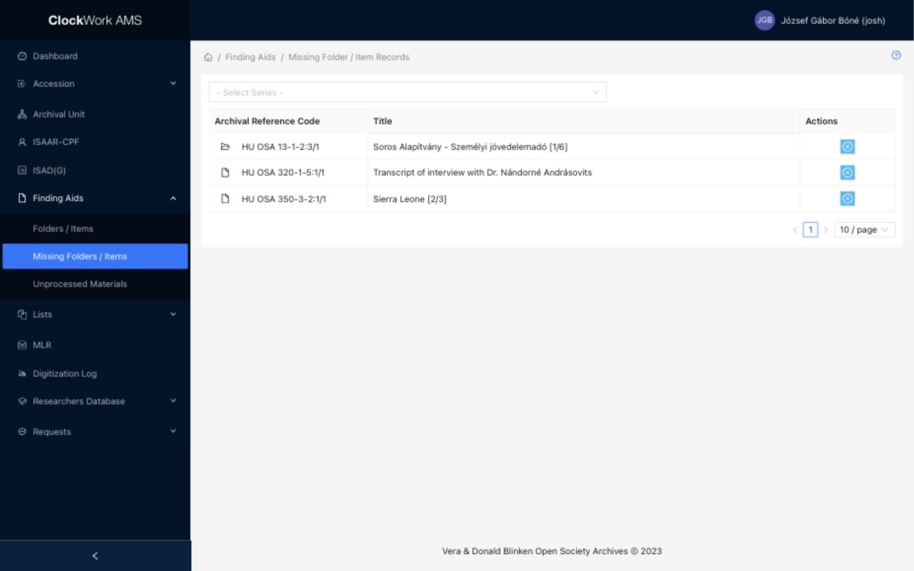

# Finding Aids: Missing Folders / Items

The **Missing Folders / Items** submenu provides a focused review list of Folder / Item records that have been marked as missing. Access requires the **Finding Aids** group.

*The Missing Folders / Items list supports review of records marked as missing.*

## Filter

Use the **Series** filter above the table to limit the results to one Series. Clear the filter to return to the complete missing-record list.

## Columns

| Column | Description | Sortable |
|---|---|---|
| Archival Reference Code | Identifies the missing Folder / Item record. | No |
| Title | Displays the record title. | No |
| Actions | Provides **Set non missing**. | No |

## Row action

| Action | Description | Effect |
|---|---|---|
|  **Set non missing** | Opens a confirmation dialog for the selected record. | Confirming clears the record's missing status and removes it from this list. It does not delete the record. |

Records are marked as missing or non-missing from the publication and status controls in [Finding Aids - Folders / Items](finding-aids.md#folder-item-row-actions). The list has no footer creation action; create and maintain Folder / Item records from that module.
