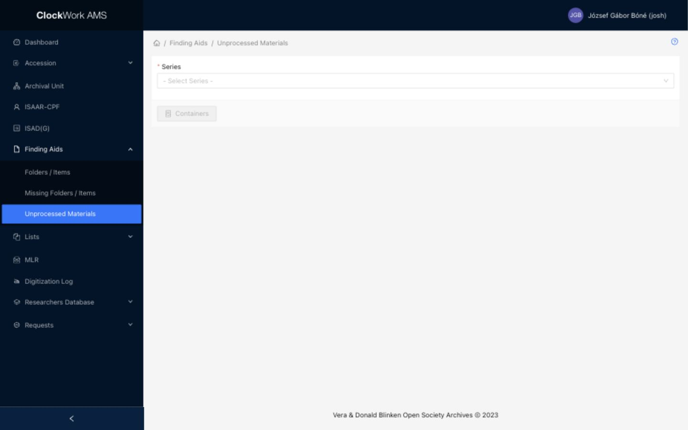

# Finding Aids: Unprocessed Materials

The **Unprocessed Materials** submenu manages containers assigned to the separate unprocessed-materials workflow. Access requires the **Unprocessed Materials** group and may differ from ordinary Finding Aids access.

## Select a Series

*Unprocessed Materials begins with a Series selector restricted to the unprocessed-materials workflow.*

Select the appropriate Series and then select **Containers**. Unlike the [Folders / Items selector](finding-aids.md#select-an-archival-unit), this screen does not require separate Fonds and Subfonds selections.

The **Containers** button remains disabled until a Series is selected. AMS remembers the most recent selection for this workflow, but check the displayed Series before creating or moving containers.

## Container List

The Container List displays containers assigned to the selected unprocessed Series. It uses the same basic container metadata as the ordinary Container List, but container rows do not expand into Folder / Item tables.

### Columns

| Column | Description | Sortable |
|---|---|---|
| Container No. | Displays the container reference number generated for the selected Series. | No |
| Barcode | Displays the barcode. Select the value, or the barcode button when empty, to maintain barcode information in a drawer. | No |
| Carrier Type | Displays the selected physical carrier type. | No |
| Digital Copies | Displays counts of master and access copies where digital-version information exists. | No |
| Action | Provides Edit, Delete when permitted, and Move container. | No |

### Row actions

| Action | Availability | Description | Effect |
|---|---|---|---|
| Barcode | All containers | Opens the container's barcode form in a drawer. | Saves the barcode when the drawer form is submitted. |
| Digital Copies | Containers with digital-version information | Opens the digital versions drawer. | Changes are saved from the drawer form. |
| Edit | All containers | Opens the Container Form in a drawer. | Saves changes when the form is submitted. |
| Delete | Removable containers only | Opens a confirmation dialog. | Confirming permanently removes the container. The button is disabled when the container is not removable. |
| Move container | All containers | Opens the container-movement form. | Submitting moves the container to the selected destination in the processed Finding Aids hierarchy. |

Publication controls, Templates, Table View, and Label Print are not displayed in this workflow.

### Footer actions

| Action | Description | Effect |
|---|---|---|
| Container Form | Expands or collapses the container creation form above the list. | Does not create a container by itself. |
| Close | Returns to the unprocessed Series selector. | Does not change records. |

## Container Form

Select **Container Form** to display the creation form. The fields and behavior match the [Folders / Items Container Form](finding-aids.md#container-form): the Series relationship and next Container No. are supplied by AMS, Carrier type is required, and Barcode, Legacy ID, and Container Label are optional.

!!! important "New Container creates the record immediately"
    **New Container** submits the form. When the request succeeds, the new container is immediately saved and displayed in the table. The form then refreshes with the next system-generated Container No.
