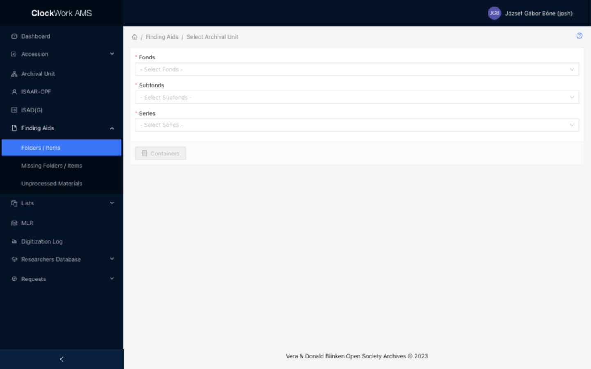

# Finding Aids: Folders / Items

Finding Aids describe archival material at container, folder, and item level. The **Folders / Items** submenu is used to select a Series, manage its containers, and create or maintain Folder / Item records and templates. Access requires the **Finding Aids** group.

The Folders / Items workflow has two stages. First select the appropriate Fonds, Subfonds, and Series. Then open the Container List for the selected Series.

## Select an Archival Unit

*Select a Fonds, Subfonds, and Series to enable the Containers button.*

The three fields are dependent selects:

| Field | Description |
|---|---|
| Fonds | Select the Fonds containing the material. This selection determines which Subfonds are available. |
| Subfonds | Select a Subfonds within the chosen Fonds. This selection determines which Series are available. |
| Series | Select the Series whose containers and Folder / Item records you want to manage. |

Changing the Fonds clears the existing Subfonds and Series selections. Changing the Subfonds clears the existing Series selection. This prevents a Series from remaining selected under the wrong parent hierarchy.

The **Containers** button remains disabled until a Series is selected. Select it to open the Container List. AMS remembers the most recent selection for this workflow, but always check the displayed hierarchy before creating or editing records.

## Container List

The Container List displays the containers assigned to the selected Series. Each container row can be expanded with the plus icon to display its Folder / Item records; use the minus icon to collapse it again.

### Columns

| Column | Description | Sortable |
|---|---|---|
| Expand | Opens or closes the Folder / Item list belonging to the container. | No |
| Container No. | Displays the container reference number generated for the selected Series. | No |
| Barcode | Displays the barcode. Select the value, or the barcode button when empty, to maintain barcode information in a drawer. | No |
| Carrier Type | Displays the selected physical carrier type. | No |
| Digital Copies | Displays counts of master and access copies. Select a populated badge to open the digital versions drawer. “On Folder / Item level” means digital copies are recorded on underlying records instead. | No |
| Actions | Provides Edit and, where permitted, Delete. | No |
| Publish | Publishes or unpublishes all Folder / Item records in the container and displays the total and published counts. | No |

!!! note "Digital Copies are added automatically"
    The Digital Copies information displayed in the container and Folder / Item tables is inserted into the AMS database automatically by the digital preservation workflows. The master and access-copy counts therefore reflect digital objects connected by those automated processes, rather than ordinary descriptive metadata entered in the table.

### Row actions

| Action | Availability | Description | Effect |
|---|---|---|---|
| Expand / Collapse | All containers | Shows or hides the Folder / Item table belonging to the container. | Changes only the table display. |
| Barcode | All containers | Opens the container's barcode form in a drawer. | Saves the barcode when the drawer form is submitted. |
| Digital Copies | Containers with digital-version information | Opens the digital versions drawer. | Changes are saved from the drawer form. |
| Edit | All containers | Opens the Container Form in a drawer. | Saves changes when the form is submitted. |
| Delete | Removable containers only | Opens a confirmation dialog. | Confirming permanently removes the container. AMS does not offer Delete when the container is not removable. |
| Publish all in container | A container with at least one record when not all are published | Opens a confirmation dialog. | Publishes every Folder / Item record in that container. |
| Unpublish all in container | A container whose records are all published | Opens a confirmation dialog. | Unpublishes every Folder / Item record in that container from the public catalog. |

### Footer actions

| Action | Description | Effect |
|---|---|---|
| Container Form | Expands or collapses the container creation form above the list. | Does not create a container by itself. |
| Templates | Expands or collapses the template list below the Container List. | Does not change any records. |
| [Table View](#table-view) | Opens a grid view for comparing and working with the Series' Folder / Item descriptions. | Changes the current presentation of the records. |
| [Label Print](#label-print) | Opens the available label-print options for the selected Series. | Starts the selected label output workflow. Review the chosen label type before continuing. |
| Publish | Opens a confirmation dialog for the entire Series. | Publishes all Folder / Item records in the selected Series. |
| Unpublish | Opens a confirmation dialog for the entire Series. | Unpublishes all Folder / Item records in the selected Series from the public catalog. |
| Close | Returns to the Fonds, Subfonds, and Series selector. | Does not change records. |

## Container Form

Select **Container Form** in the footer to display the creation form above the Container List. The same button collapses the form when it is open.

| Field | Requirement | Guidance |
|---|---|---|
| Archival Unit | Required, system supplied | Links the container to the Series selected on the preceding screen. It is hidden and cannot be changed in this form. |
| Container No. | System supplied | Displays the next container number. It is read-only. |
| Carrier type | Required | Select a value from the Carrier Types controlled list. |
| Barcode | Optional | Enter the container barcode when applicable. |
| Legacy ID | Optional | Preserve a corresponding identifier from the legacy system. |
| Container Label | Optional | Enter additional label text used to identify the container. |

!!! important "New Container creates the record immediately"
    **New Container** submits the creation form. When the request succeeds, the new container is immediately saved and appears in the Container List; this is not a preview or an additional step toward creation. The form then refreshes with the next system-generated Container No. so another container can be entered.

The Edit action opens a drawer containing **Container No.**, **Carrier type**, **Container label**, **Legacy ID**, and **Internal Note**. Container No. remains read-only. Submit the drawer form to save the edited values.

## Folder / Item Records List

Select the plus icon at the beginning of a container row to display the Folder / Item records inside it.

### Columns

| Column | Description | Sortable |
|---|---|---|
| Archival Reference Code | Displays the full reference code of the Folder / Item record. | No |
| Title | Displays the record title. | No |
| Date | Displays Date From, followed by Date To when an end date exists. | No |
| Digital Copies | Displays master and access-copy counts. Select a populated badge to open the digital versions drawer. “On Container level” means digital copies are recorded on the parent container. | No |
| Actions | Provides Quick Edit, Edit, Delete when permitted, a Catalog URL for published records, and Clone. | No |
| Publish | Provides publication, missing-status, and confidential-status controls. | No |

### Row actions { #folder-item-row-actions }

| Action | Description | Effect |
|---|---|---|
| Quick Edit | Opens the compact Folder / Item form in a drawer. | Saves changes when the drawer form is submitted. |
| Edit | Opens the full Folder / Item Form. | Saves changes when the form is submitted. |
| Delete | Opens a confirmation dialog when the record is removable. | Confirming permanently removes the Folder / Item record. |
| Catalog URL | Opens the published record in the [Blinken OSA Archival Catalog](https://catalog.archivum.org/). | Does not change the AMS record. This action is shown only when a catalog record is available. |
| Clone | Opens a confirmation dialog. | Confirming immediately creates a new Folder / Item record by cloning the selected record and refreshes the lists. Review the clone afterward, particularly its identifiers, title, dates, and inherited metadata. |
| Publish / Unpublish | Opens a confirmation dialog. | Publishes the record to, or removes it from, the public catalog. |
| Set missing / Set non-missing | Opens a confirmation dialog. | Changes the record's missing status. A record marked missing is included in **Missing Folders / Items**; setting it non-missing removes it from that review list without deleting it. |
| Set confidential / Unset confidential | Opens a confirmation dialog. | Changes the record's confidential status. Review the confidentiality display text and access metadata in the form before publishing. |

### Footer actions

| Action | Description |
|---|---|
| New Folder / Item | Opens a blank full Folder / Item Form for the expanded container. The new record is created only when the form is submitted successfully. |
| New from Template | Lists templates available for the selected Series. Selecting one opens a new Folder / Item Form prefilled from that template. |

## Folder / Item Form

The Folder / Item Form is used to create and edit Folder / Item records. **New Folder / Item** opens it with fresh system identifiers for the selected container; **Edit** opens the saved values of an existing record.

| Mode | Behavior | Footer actions |
|---|---|---|
| Create | Enter a new record. The selected container and generated identifiers are supplied by AMS. | **Submit** creates the record; **Close** returns without creating it. |
| Edit | Change an existing record. Its description level and generated identifiers cannot be changed. | **Submit** saves the changes; **Close** returns without submitting; **Show Info** displays creation and update information and the audit log. |

### Identifier fields

These fields appear above the five tabs.

| Field | Requirement | Input or source | Guidance |
|---|---|---|---|
| Archival Unit | Required, system supplied | Hidden relationship | Links the record to the Series through its selected container. It cannot be changed in the form. |
| Description level | Required | Select: Level 1 or Level 2 | Choose the structural description level during creation. It becomes read-only after the record is created. |
| Level | Required | Select: Folder or Item | Level 1 permits Folder or Item; Level 2 is an Item within an existing folder. It becomes read-only after creation. |
| Folder No. | Required | Select/system value | For Level 1, AMS supplies the next folder number. For Level 2, select the folder to which the Item belongs. |
| Sequence No. | Required, system supplied | Read-only | AMS calculates the record's sequence within the selected container and level. |
| Archival Reference Code | System supplied | Read-only | Displays the reference code generated from the Archival Unit, container, folder, and sequence information. |

Every field identified below as [Formatted Text](../getting-started/special-form-fields.md#formatted-text-fields) uses Markdown syntax. The published Archival Catalog renders that Markdown as formatted content.

### Basic Metadata tab

| Field | Requirement | Input or source | Guidance |
|---|---|---|---|
| Legacy ID | Optional | Text | Preserve the corresponding identifier from the legacy system when applicable. |
| Primary Type | Optional | Select using the Primary Types controlled list | Choose the main material or record type. |
| Original locale | Optional | [Original Locale select](../getting-started/special-form-fields.md#original-locale-and-translated-fields) | Select the language used by paired Original Language fields before entering or translating their content. |
| UUID | Required, system supplied | Read-only | Displays the unique identifier generated by AMS. |
| Title | Required | Text | Enter the English or principal display title. A translation control can populate the paired original-language field. |
| Title - Original Language | Optional | Text | Enter the title in the selected Original locale. A translation control can populate the English Title when it is empty. |
| Date From | Required | [Partial-date text](../getting-started/special-form-fields.md#date-fields) | Enter `YYYY`, `YYYY-MM`, or `YYYY-MM-DD`. |
| Date To | Optional | [Partial-date text](../getting-started/special-form-fields.md#date-fields) | Enter the end of the range in the same format as Date From, or leave it empty for a single/open date. |
| Date Ca. Span | Optional | Text | Qualify the main date span when approximate-date information is needed. |
| Dates: Date from | Optional, repeatable | Text | Enter the beginning of an additional date or date range. |
| Dates: Date to | Optional, repeatable | Text | Enter the end of the additional date range when applicable. |
| Dates: Date type | Optional, repeatable | Select using the Date Types controlled list | Identify the meaning of the corresponding additional date row. |
| Access Rights | Required | Select: Not Restricted or Restricted | Select the access state that applies to the material. This choice affects researcher requests and the aggregated Catalog display; see [Access Rights effects](#access-rights-effects). |
| Restriction Date | Optional | Date picker | Record the date on which a restriction changes or expires. **+5Y** and **-5Y** adjust the value by five years, using Date From as a starting point when appropriate. |
| Restriction Explanation | Optional | Multiline text | Explain the restriction and any conditions staff need to understand. |
| Contents Summary | Optional | [Formatted Text](../getting-started/special-form-fields.md#formatted-text-fields) | Summarize the contents for discovery and description. A translation control can populate the paired original-language field. |
| Contents Summary - Original Language | Optional | [Formatted Text](../getting-started/special-form-fields.md#formatted-text-fields) | Record the summary in the selected Original locale. A translation control can populate the English summary. |
| Confidential | Optional | Checkbox | Marks the record as confidential. This status can also be changed from the Folder / Item Records List. |
| Confidential Display Text | Optional | Text | Enter the message that should be displayed in place of confidential descriptive information. |

Use **Add** to enter additional Dates rows and the remove control to discard a row. See [repeatable field groups](../getting-started/special-form-fields.md#repeatable-field-groups-and-subforms).

#### Access Rights effects

The **Access Rights** value has consequences beyond the Folder / Item Form. It controls how the material can move through the researcher-request workflow and contributes to the access status shown on higher-level descriptions in the Archival Catalog.

| Access Rights value | Researcher-request effect |
|---|---|
| Not Restricted | The record can be requested and served to a researcher through the ordinary request workflow. It does not require a restricted-access decision. |
| Restricted | The researcher must provide additional information explaining the request, including the research subject and motivation for seeking access. The requested record is held from service and remains pending until an authorized decision is recorded in [Restricted Access Management](../reference-services/requests.md#restricted-access-management). |

When a request contains restricted material, AMS stores the researcher's additional explanation with the request and notifies the restricted-access decision makers. The resulting decision determines whether access is granted, granted with conditions, limited to on-site viewing, or denied.

!!! warning "Changing Access Rights changes request handling"
    Setting a record to Restricted introduces the additional explanation and approval workflow. Setting it to Not Restricted removes that restriction requirement. Because requests remain linked to the Folder / Item record, changing this field may also affect how an existing request is evaluated or displayed. Review active requests and confirm the restriction basis, Restriction Date, and Restriction Explanation before submitting the record.

#### Aggregated Access Rights in the Archival Catalog

The Catalog summarizes the Access Rights of the non-template Folder / Item records beneath each Series. It displays:

| Underlying Folder / Item records | Catalog display |
|---|---|
| All are Not Restricted | **Not Restricted** |
| A mixture of Restricted and Not Restricted | **Partially Restricted**, with the numbers of Restricted and Not Restricted Folder / Item records |
| All are Restricted | **Restricted** |

This calculated status is propagated upward through the descriptive hierarchy. A Series summarizes its own Folder / Item records, a Subfonds summarizes the records in its underlying Series, and a Fonds summarizes the records below its Subfonds. Changing one Folder / Item record can therefore alter the Access Rights display of its Series and higher-level Subfonds or Fonds descriptions in the Catalog.

### Extra Metadata tab

| Field | Requirement | Input or source | Guidance |
|---|---|---|---|
| Identifiers: Identifier | Optional, repeatable | Text | Enter an additional identifier. |
| Identifiers: Identifier Type | Optional, repeatable | Select using the Identifier Types controlled list | Identify the system or category of the corresponding identifier. |
| Form/Genre | Optional, multiple | Select using the Form/Genre authority list | Select every applicable documentary form or genre. |
| Time Start | Optional | Time text | For timed audiovisual material, enter the start as `hh:mm:ss`. |
| Time End | Optional | Time text | Enter the end as `hh:mm:ss` when only part of the source is described. |
| Duration | System calculated | Read-only | AMS calculates the duration from the entered time values when they are valid. |
| Physical Condition | Optional | [Formatted Text](../getting-started/special-form-fields.md#formatted-text-fields) | Describe condition, damage, preservation issues, or handling concerns. |
| Physical Description | Optional | [Formatted Text](../getting-started/special-form-fields.md#formatted-text-fields) | Describe the carrier and other relevant physical characteristics. A translation control can populate the paired original-language field. |
| Physical Description - Original Language | Optional | [Formatted Text](../getting-started/special-form-fields.md#formatted-text-fields) | Record the physical description in the selected Original locale. A translation control can populate the English field. |
| Languages: Language | Optional, repeatable | Select using the Languages authority list | Select a language present in the described material. |
| Languages: Language Usage | Optional, repeatable | Select using the Language Usages controlled list | Qualify how the selected language is used. |
| Language Statement | Optional | [Formatted Text](../getting-started/special-form-fields.md#formatted-text-fields) | Add a narrative language or script statement when the structured rows are insufficient. |
| Language Statement - Original Language | Optional | [Formatted Text](../getting-started/special-form-fields.md#formatted-text-fields) | Record the statement in the selected Original locale. |
| Extent: Extent Number | Optional, repeatable | Text | Enter the quantity for the extent row. |
| Extent: Extent Unit | Optional, repeatable | [Select with Add and Edit](../getting-started/special-form-fields.md#select-with-add-and-edit) using Extent Units | Select the unit of measurement; create or edit a controlled value only when authorized. |

Identifiers, Languages, and Extent are [repeatable field groups](../getting-started/special-form-fields.md#repeatable-field-groups-and-subforms). Enter one distinct value and its qualifier in each row.

### Contributors tab

This tab records entities associated with the material and the roles they performed. All four groups are repeatable.

| Field group | Entity field | Role field | Guidance |
|---|---|---|---|
| Contributors (People) | [Select with Add and Edit](../getting-started/special-form-fields.md#select-with-add-and-edit) using People | [Select with Add and Edit](../getting-started/special-form-fields.md#select-with-add-and-edit) using Person Roles | Link a person and identify that person's role. |
| Contributors (Organisations) | [Select with Add and Edit](../getting-started/special-form-fields.md#select-with-add-and-edit) using Corporations | [Select with Add and Edit](../getting-started/special-form-fields.md#select-with-add-and-edit) using Corporation Roles | Link an organisation and identify its role. |
| Additional Countries | [Select with Add and Edit](../getting-started/special-form-fields.md#select-with-add-and-edit) using Countries | [Select with Add and Edit](../getting-started/special-form-fields.md#select-with-add-and-edit) using Geographic Roles | Link a country associated with the material and explain the relationship through its role. |
| Additional Places | [Select with Add and Edit](../getting-started/special-form-fields.md#select-with-add-and-edit) using Places | [Select with Add and Edit](../getting-started/special-form-fields.md#select-with-add-and-edit) using Geographic Roles | Link a place associated with the material and explain the relationship through its role. |

Submitting a newly created or edited authority or controlled-list value in a drawer saves that related record separately. Closing the Folder / Item Form afterward does not undo the related-record change.

### Subjects tab

| Field | Requirement | Input or source | Guidance |
|---|---|---|---|
| Spatial Coverage (Countries) | Optional, multiple | Select using the Countries authority list | Select countries represented by or relevant to the content. |
| Spatial Coverage (Places) | Optional, multiple | [Select with Add and Edit](../getting-started/special-form-fields.md#select-with-add-and-edit) using Places | Link more specific geographic places. |
| Subject (People) | Optional, multiple | [Select with Add and Edit](../getting-started/special-form-fields.md#select-with-add-and-edit) using People | Link people who are subjects of the material rather than contributors to it. |
| Subject (Corporations) | Optional, multiple | [Select with Add and Edit](../getting-started/special-form-fields.md#select-with-add-and-edit) using Corporations | Link organisations that are subjects of the material. |
| Keywords | Optional, multiple | [Select with Add and Edit](../getting-started/special-form-fields.md#select-with-add-and-edit) using Keywords | Assign controlled subject terms that support discovery. |

### Notes tab

| Field | Requirement | Input or source | Guidance |
|---|---|---|---|
| Note | Optional | [Formatted Text](../getting-started/special-form-fields.md#formatted-text-fields) | Record public descriptive information that does not belong in a more specific field. A translation control can populate the paired original-language field. |
| Note - Original Language | Optional | [Formatted Text](../getting-started/special-form-fields.md#formatted-text-fields) | Record the public note in the selected Original locale. A translation control can populate the English Note. |
| Internal Note | Optional | [Formatted Text](../getting-started/special-form-fields.md#formatted-text-fields) | Record staff-only information that should not be treated as public descriptive content. |

### Multilingual and repeatable values

Select **Original locale** before entering paired Original Language values or using DeepL-assisted translation. Translation output is a draft and must be reviewed before submission. See [Original Locale and translated fields](../getting-started/special-form-fields.md#original-locale-and-translated-fields).

Removing a saved repeatable row and submitting the form removes that relationship from the Folder / Item record. Related authority and controlled-list records created through [Select with Add and Edit](../getting-started/special-form-fields.md#select-with-add-and-edit) continue to exist independently.

## Templates

Templates are reusable Finding Aids record templates. They allow a prefilled form to be prepared and reused when creating Folder / Item records. Templates are especially useful when many records in a collection repeat values such as the same Contributors, Subjects, languages, access information, or descriptive text.

Select **Templates** in the Container List footer to display the templates belonging to the selected Series.

### Template List

| Column | Description | Sortable |
|---|---|---|
| Template Name | Identifies the reusable template. | No |
| Actions | Provides Edit and, where permitted, Delete. | No |

The **New Template** footer button opens the Template Form. Existing templates can be edited, while Delete is available only when AMS considers the template removable.

### Template Form and use

The Template Form uses the same descriptive tabs and most of the same fields as the Folder / Item Form. It also contains **Template Name** to identify the template in selection lists. Complete only the values that should be proposed whenever this template is used, and avoid placing record-specific information in reusable fields.

To create a record from a template:

1. Expand the appropriate container in the Container List.
2. Select **New from Template** below its Folder / Item table.
3. Choose a template available for the Series.
4. Review and adjust all prefilled values in the new Folder / Item Form.
5. Submit the form to create the record.

The selected template supplies copied starting values. AMS supplies fresh system values for the new record, including its container relationship, sequence information, UUID, and Archival Reference Code. Choosing a template does not create a record until the form is submitted.

!!! note "Templates do not remain linked to created records"
    A record created from a template receives a copy of the template's values. Editing the template later does not retroactively update records already created from it.

## Table View

**Table View** opens all Folder / Item records from the selected Series in an Excel-style spreadsheet editor. It is useful for comparing records, correcting repeated metadata, and making consistent changes across a large Series without opening each full form separately.

The grid contains these editable columns:

- Legacy ID;
- Title and Title (Original);
- Locale;
- Contents Summary and Contents Summary (Original);
- Date (From) and Date (To);
- Access Rights and Restriction Date;
- Start Time and End Time; and
- Note and Note (Original).

**Archival Reference Code** is included for identification but is read-only. Columns can be moved or resized, and their menus provide spreadsheet-style filtering. **Export** downloads the grid as an Excel `.xlsx` file.

### Find and Replace

Enter text in **Find** and select **Find** to move to a matching cell. Select **Find** again to move through further matches.

Enter replacement text and use one of these actions:

| Action | Effect |
|---|---|
| Replace | Replaces matching text in the currently selected search result. |
| Replace All | Opens a confirmation prompt and replaces every matching occurrence in the loaded Series grid. |

!!! warning "Table View saves edits immediately"
    A changed cell is submitted to AMS immediately; there is no final batch **Submit** button. **Replace All** can therefore update many Folder / Item records at once. Confirm the Find and Replace values carefully, especially capitalization, names, dates, and text that may occur inside a longer word. A success or error message and cell styling report the result of each update.

## Label Print

**Label Print** generates printable labels for the archival containers in the selected Series. AMS groups the containers by **Carrier Type** and displays the number of containers in each group in the dropdown.

A green indicator means that a label template is configured for that Carrier Type. Selecting an available group uses its JasperReports template to create a PDF containing one label for every container in the selected Series. A group without a configured Jasper template is displayed as unavailable and cannot generate a report.

The label may include the Fonds, Subfonds, and Series numbers and titles, container number, first and last Folder titles and dates, and the Series access-restriction statement, depending on the configured template and available metadata.

The JasperReports template lays out the PDF for the predefined Avery label-sheet paper size. Print the PDF onto the corresponding Avery sticker sheets, then apply the printed stickers to the archival boxes.

!!! important "Check print alignment"
    Use the Avery sheet specified for the configured template and check the printer's paper-size and scaling settings before printing a complete batch. Printing with an incompatible sheet or unintended scaling can move the content outside the sticker boundaries. A test page on plain paper is recommended before using label stock.
