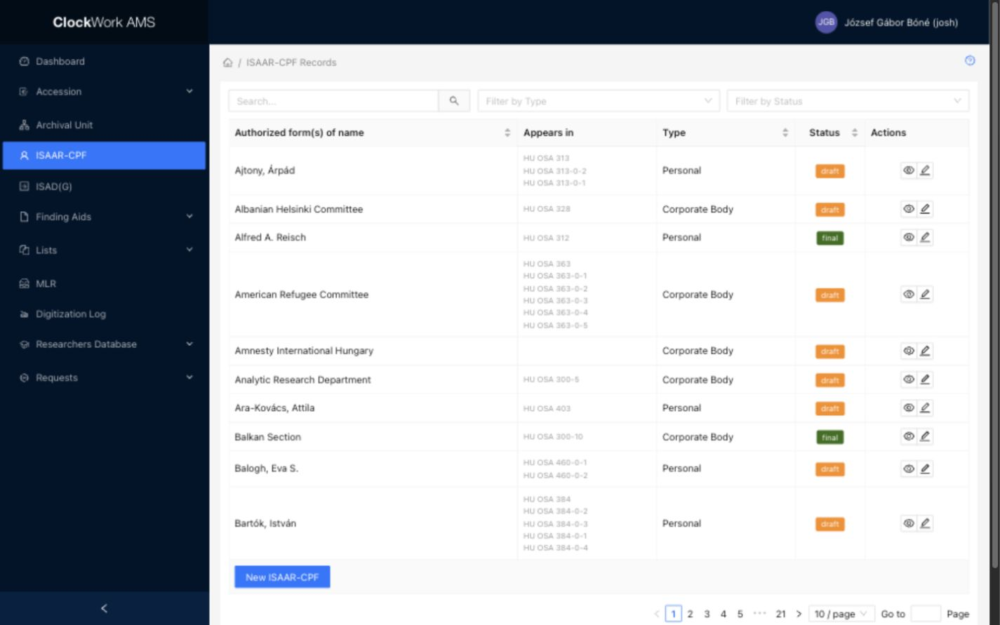

# ISAAR-CPF records

ISAAR-CPF records describe people, families, and corporate bodies associated with archival material. AMS follows descriptive elements from the International Council on Archives standard [**ISAAR(CPF): International Standard Archival Authority Record for Corporate Bodies, Persons and Families, Second Edition**](https://www.ica.org/app/uploads/2023/12/CBPS_Guidelines_ISAAR_Second-edition_EN.pdf). Access requires the **ISAAR** group.

The element numbers below refer to section 5 of the standard. AMS implements a selected set of those elements; it is not a replacement for the standard itself.

## ISAAR-CPF Records List

*The ISAAR-CPF Records list provides search, Type and Status filters, sortable columns, row actions, and the New ISAAR-CPF button.*

### Filters

Filters appear above the table and limit the records displayed.

| Filter | Description |
|---|---|
| Search | Enter a free-text query to search **Authorized form(s) of name**. Clear the field to restore the unfiltered list. |
| Filter by Type | Select **Personal**, **Corporate Body**, or **Family**. |
| Filter by Status | Select **draft** or **final**. |

Filters can be combined. Search for an existing authority record before creating a new one to avoid splitting references between duplicate names.

### Columns

| Column | Description | Sortable |
|---|---|---|
| Authorized form(s) of name | The authorized access point for the person, family, or corporate body. This corresponds to ISAAR(CPF) **5.1.2**. | Yes |
| Appears in | Lists the reference codes of ISAD(G) descriptions linked to the authority record as creator. | No |
| Type | Identifies the entity as a person, family, or corporate body. This corresponds to ISAAR(CPF) **5.1.1**. | Yes |
| Status | Displays the authority record's workflow status. This corresponds to ISAAR(CPF) **5.4.4**. | Yes |
| Actions | Buttons for operations available on the row. | No |

Select a sortable column heading to change the table order.

!!! note "Appears in is not the Relationships Area"
    **Appears in** reports links from ISAD(G) descriptions to this authority record. The current ISAAR-CPF Form does not provide fields for the ISAAR(CPF) **5.3 Relationships Area**, which describes relationships between corporate bodies, persons, or families.

### Row actions

| Action | Description | Effect |
|---|---|---|
| View | Opens the ISAAR-CPF Form in read-only mode. | Does not change the record. |
| Edit | Opens the ISAAR-CPF Form with editable fields. | The record changes only after **Submit** is selected. ISAD(G) records linked to this authority record will display its updated authorized name. |

The current list provides View and Edit actions. It does not display a Delete action.

### Footer action

**New ISAAR-CPF** opens the ISAAR-CPF Form in Create mode. Opening the form does not create a record; the new authority record is created when the completed form is submitted successfully.

## ISAAR-CPF Form

The ISAAR-CPF Form is used to view, create, and edit authority records. Its fields are organized into **Required Values**, **Identity**, **Description**, and **Control** tabs.

| Mode | Field behavior | Available actions |
|---|---|---|
| View | Record fields and repeatable groups are read-only. | **Close** and **Show Info** |
| Create | Editable fields accept a new authority record. Control values managed by AMS remain disabled. | **Submit** and **Close** |
| Edit | Editable fields contain the current values. Control values managed by AMS remain disabled. | **Submit**, **Close**, and **Show Info** |

**Show Info** displays creation and update information and the record's audit log. These dates support ISAAR(CPF) **5.4.6 Dates of creation, revision or deletion**. **Close** returns to the ISAAR-CPF Records list without submitting the form.

The ISAAR(CPF) standard identifies four essential elements: **5.1.1 Type of entity**, **5.1.2 Authorized form(s) of name**, **5.2.1 Dates of existence**, and **5.4.1 Authority record identifier**. AMS requires the first three as user-entered values and manages the displayed authority-record identifier as a read-only value.

### Required Values tab

| Field | ISAAR(CPF) element | Requirement | Input or source | Guidance |
|---|---|---|---|---|
| Authorized forms of name | **5.1.2 Authorized form(s) of name** | Required | Text | Enter the authorized access point according to the institution's naming rules. The value must be unique in AMS. |
| Type | **5.1.1 Type of entity** | Required | Select | Select **Personal**, **Corporate Body**, or **Family**. |
| Date of existence (from) | **5.2.1 Dates of existence** | Required | [Partial-date text](../getting-started/special-form-fields.md#date-fields) | Enter the beginning of the entity's existence using the most precise known value: `YYYY`, `YYYY-MM`, or `YYYY-MM-DD`. |
| Date of existence (to) | **5.2.1 Dates of existence** | Optional | [Partial-date text](../getting-started/special-form-fields.md#date-fields) | Enter the end of the entity's existence when applicable or known. |

For a person, the dates normally describe birth and death or a known period of activity; for a corporate body, establishment and dissolution; and for a family, its relevant period of existence.

### Identity tab

All fields on this tab are optional [repeatable field groups](../getting-started/special-form-fields.md#repeatable-field-groups-and-subforms). Use **Add** for each distinct name or identifier and the remove button to delete a row before submitting the form.

| Field group and subfield | ISAAR(CPF) element | Input or source | Guidance |
|---|---|---|---|
| Parallel forms of name: Name | **5.1.3 Parallel forms of name** | Text | Record an authorized form of name in another language or script under the applicable conventions. |
| Other forms of name: Name | **5.1.5 Other forms of name** | Text | Record another form such as an earlier or later name, abbreviation, or informal form. |
| Other forms of name: Year from | **5.1.5 Other forms of name** | Year | Enter the first year in which this name form applied, when known. |
| Other forms of name: Year to | **5.1.5 Other forms of name** | Year | Enter the last year in which this name form applied, when known. |
| Other forms of name: Relationship | **5.1.5 Other forms of name** | Select using the ISAAR relationship controlled list | Qualify how the other name relates to the authorized form. This qualifier concerns a name variant; it is not an ISAAR(CPF) 5.3 entity relationship. |
| Standardized names: Name | **5.1.4 Standardized forms of name according to other rules** | Text | Enter a name standardized under another rule or convention. |
| Standardized names: Standard | **5.1.4 Standardized forms of name according to other rules** | Text | Identify the rule or standard used for that name form. |
| Corporate body identifiers: Identifier | **5.1.6 Identifiers for corporate bodies** | Text | Enter an official or external identifier. Use this group for corporate bodies when applicable. |
| Corporate body identifiers: Rule | **5.1.6 Identifiers for corporate bodies** | Text | Identify the rule, registry, or system governing the identifier. |

### Description tab

| Field | ISAAR(CPF) element | Requirement | Input or source | Guidance |
|---|---|---|---|---|
| Places: Place | **5.2.3 Places** | Optional, repeatable | Text | Record a place connected with the entity. |
| Places: Year from | **5.2.3 Places** | Optional, repeatable | Year | Enter the beginning of the connection with the place, when known. |
| Places: Year to | **5.2.3 Places** | Optional, repeatable | Year | Enter the end of the connection with the place, when known. |
| Places: Qualifier | **5.2.3 Places** | Optional, repeatable | Select using the Place Qualifiers controlled list | Describe the nature of the connection with the place. |
| Function | **5.2.5 Functions, occupations and activities** | Optional | [Formatted Text](../getting-started/special-form-fields.md#formatted-text-fields) | Record the entity's functions, occupations, activities, roles, or responsibilities. |
| Legal status | **5.2.4 Legal status** | Optional | Text | Record the legal status of a corporate body and cite the relevant jurisdiction or classification when needed. |
| General context | **5.2.8 General context** | Optional | [Formatted Text](../getting-started/special-form-fields.md#formatted-text-fields) | Describe the broader social, political, economic, cultural, or administrative context. |
| History | **5.2.2 History** | Optional | [Formatted Text](../getting-started/special-form-fields.md#formatted-text-fields) | Provide a concise narrative or chronology of the entity's principal events, activities, achievements, and roles. |
| Mandate | **5.2.6 Mandates/Sources of authority** | Optional | [Formatted Text](../getting-started/special-form-fields.md#formatted-text-fields) | Record mandates, legislation, charters, or other sources of authority governing the entity. |
| Internal structure | **5.2.7 Internal structures/Genealogy** | Optional | [Formatted Text](../getting-started/special-form-fields.md#formatted-text-fields) | For a corporate body, describe internal structure; for a family, describe genealogy; for a person, record relevant family relationships where appropriate. |

### Control tab

Most Control-tab fields are system-managed or retained from legacy data and cannot be edited in the current form.

| Field | ISAAR(CPF) element | Requirement | Input or source | Guidance |
|---|---|---|---|---|
| Institution identifier | **5.4.2 Institution identifiers** | System managed | Read-only | Identifies the institution responsible for the authority record; AMS displays its configured institutional code. |
| Authority record identifier | **5.4.1 Authority record identifier** | System managed | Read-only | Displays the authority-record or legacy identifier stored by AMS. |
| Language | **5.4.7 Languages and scripts** | Optional | Multiple-select field using the Languages authority list | Select the language or languages used in the authority record. AMS does not provide a separate script field here. |
| Level of detail | **5.4.5 Level of detail** | System managed | Read-only | Displays the configured level of detail, such as Minimal. |
| Status | **5.4.4 Status** | System managed | Read-only | Displays the workflow status, such as Draft or Final. |
| Convention | **5.4.3 Rules and/or conventions** | System managed or legacy | Read-only multiline text | Identifies rules or conventions applied in preparing the authority record. |
| Source | **5.4.8 Sources** | System managed or legacy | Read-only multiline text | Identifies sources consulted in preparing the authority record. |
| Internal note | **5.4.9 Maintenance notes** | System managed or legacy | Read-only multiline text | Records information about creation and maintenance that is not intended as descriptive content. |

### Effects of editing an ISAAR-CPF record

- Repeatable Identity and Places rows are saved as related data belonging to the authority record. Removing a saved row and submitting the form removes that related entry.
- ISAD(G) descriptions linked to the authority record remain linked after an edit and display its current authorized form of name.
- The **Appears in** column on the list reflects the reference codes of those linked ISAD(G) descriptions.

Review the **Appears in** values before making a substantial change to an authorized name.
