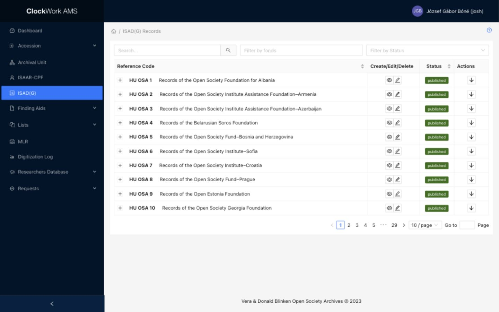

# ISAD(G) records

ISAD(G) records describe Archival Units. AMS follows descriptive elements from the International Council on Archives standard [**ISAD(G): General International Standard Archival Description, Second Edition**](https://www.ica.org/app/uploads/2024/01/CBPS_2000_Guidelines_ISADG_Second-edition_EN.pdf). Access requires the **ISAD(G)** group.

The element numbers below refer to section 3 of the standard. AMS implements a selected set of those elements and adds workflow fields for rights, translation, and publication.

## ISAD(G) Records List

*The ISAD(G) Records list is synchronized with the Archival Unit hierarchy and provides search, Fonds and Status filters, hierarchical rows, record actions, and publication controls.*

### Relationship with Archival Units

Every ISAD(G) record has a one-to-one relationship with an [Archival Unit](archival-units.md). The list is generated from the Archival Unit hierarchy rather than only from existing ISAD(G) records. Consequently, a Fonds, Subfonds, or Series remains visible here even when its ISAD(G) description has not yet been created.

The row's status and available buttons show whether the corresponding description exists:

| Status | Meaning | Available record operation |
|---|---|---|
| Not exists | The Archival Unit exists, but it has no ISAD(G) record. | **Create** |
| Draft | The ISAD(G) record exists but is not published. | **View**, **Edit**, and **Publish** |
| Published | The ISAD(G) record is published to the public catalog. | **View**, **Edit**, and **Unpublish** |

Creating or editing an Archival Unit does not itself create its ISAD(G) record. Use the Create action on the corresponding row.

### Filters

Filters appear above the table and limit the records displayed.

| Filter | Description |
|---|---|
| Search | Enter a free-text query to search the titles of Fonds, their Subfonds, and their Series. Results are presented through the matching Fonds-level hierarchies. |
| Filter by fonds | Enter a Fonds number to display that Fonds and its hierarchy. |
| Filter by Status | Select **draft**, **final**, or **none**. In the list, final records are displayed as Published and none as Not exists. |

Filters can be combined. Clear filters if an expected Archival Unit or ISAD(G) description is missing.

### Columns

| Column | Description | Sortable |
|---|---|---|
| Hierarchy control | The plus icon at the beginning of a Fonds or Subfonds row expands its underlying hierarchy; the minus icon collapses it. | No |
| Reference Code | Displays the Archival Unit reference code and title. These supply ISAD(G) **3.1.1 Reference code(s)** and **3.1.2 Title**. | Yes |
| Create/Edit/Delete | Provides record operations appropriate to the row's current state. | No |
| Status | Displays Not exists, Draft, or Published. | Yes |
| Actions | Provides Publish or Unpublish when an ISAD(G) record exists. | No |

Select a sortable column heading to change the table order. Expanding or collapsing the hierarchy changes only the list display.

### Row actions

| Action | Availability | Description | Effect |
|---|---|---|---|
| Create | Not exists | Opens the ISAD(G) Form in Create mode with the Archival Unit, reference code, title, and level prefilled. | Creates the one ISAD(G) record belonging to that Archival Unit after successful submission. |
| View | Draft or Published | Opens the ISAD(G) Form in read-only mode. | Does not change the record. |
| Edit | Draft or Published | Opens the ISAD(G) Form with editable fields. | Saves changes after **Submit**. If the record is published, saving updates its catalog representation. |
| Delete | Removable records only | Opens a confirmation dialog when AMS permits deletion. | Confirming permanently removes the ISAD(G) description, but the Archival Unit remains and returns to Not exists. |
| Publish | Draft | Opens a confirmation dialog. | Publishes this specific ISAD(G) record to the [Blinken OSA Archival Catalog](https://catalog.archivum.org/). |
| Unpublish | Published | Opens a confirmation dialog. | Removes this specific ISAD(G) record from the public catalog and affects underlying Finding Aids as described below. |

### Publication and hierarchy effects

!!! important "Publication is not inherited"
    Publishing a Fonds does not publish its Subfonds or Series. Each ISAD(G) record must be published separately. In particular, publish each Series that should appear in the public catalog even when its parent Fonds is already published.

Publishing changes only the selected ISAD(G) record's publication state. AMS records who published it and when, and sends the description to the public catalog index.

!!! warning "Unpublishing affects Finding Aids"
    When a Series is unpublished, its underlying Finding Aids records are also unpublished from the public catalog. When a Fonds is unpublished, the Finding Aids records beneath that Fonds are likewise unpublished from the catalog. This removes their public visibility even if their individual AMS records still exist.

Unpublishing one level does not automatically change the Published status displayed on other ISAD(G) rows. Review the entire hierarchy after any publication change.

### Footer action

The ISAD(G) list has no general creation button in its footer. New descriptions must be created from a Not exists row so AMS can preserve the one-to-one relationship with the correct Archival Unit.

## ISAD(G) Form

The ISAD(G) Form is used to view, create, and edit descriptions. Its fields are organized into **Required Values**, **Identity**, **Context**, **Content**, **Access & Use**, **Allied Materials**, and **Notes** tabs.

| Mode | Field behavior | Available actions |
|---|---|---|
| View | Record fields and repeatable groups are read-only. | **Close** and **Show Info** |
| Create | Accepts a new description for the selected Archival Unit. Archival Unit identity fields are prefilled and read-only. | **Submit** and **Close** |
| Edit | Editable fields contain the current values. Archival Unit identity fields remain read-only. | **Submit**, **Close**, and **Show Info** |

**Show Info** displays creation and update information and the audit log. These dates support ISAD(G) **3.7.3 Date(s) of descriptions**. **Close** returns to the ISAD(G) Records list without submitting the form.

The ISAD(G) standard identifies six elements as essential for international exchange: reference code, title, creator, dates, extent, and level of description. In AMS, the Archival Unit supplies the reference code and title; the remaining descriptive values are completed in this form.

### Required Values tab

| Field | ISAD(G) element | Requirement | Input or source | Guidance |
|---|---|---|---|---|
| Archival Unit | AMS relationship | Required, system supplied | Hidden link | Identifies the Archival Unit to which this ISAD(G) record belongs. It cannot be changed in the form. |
| Reference code | **3.1.1 Reference code(s)** | Required, system supplied | Read-only | Displays the reference code generated from the linked Archival Unit. |
| Title | **3.1.2 Title** | Required, system supplied | Read-only | Displays the title of the linked Archival Unit. Edit the Archival Unit to change it. |
| Date (from) | **3.1.3 Date(s)** | Required | Year | Enter the first year covered by the unit as `YYYY`. |
| Date (to) | **3.1.3 Date(s)** | Optional | Year | Enter the last year covered by the unit as `YYYY`; leave empty for a single or open date when appropriate. |
| Level of description | **3.1.4 Level of description** | Required | Select | Confirm Fonds, Subfonds, or Series. The initial value comes from the Archival Unit. |
| Original metadata language | AMS translation field | Optional | [Original Locale select](../getting-started/special-form-fields.md#original-locale-and-translated-fields) | Select the language/locale used in the paired original-language fields and by assisted translation. |
| Creators | **3.2.1 Name of creator(s)** | Optional, repeatable | Text | Add one free-text creator per row. |
| Creator (ISAAR) | **3.2.1 Name of creator(s)** | Optional | [Select with Add and Edit](../getting-started/special-form-fields.md#select-with-add-and-edit) using ISAAR-CPF records | Link a controlled authority record. A newly created or edited ISAAR-CPF record is saved independently, even if this ISAD(G) form is later closed without submission. |
| Language / scripts of material | **3.4.3 Language/scripts of material** | Optional | Multiple-select field using the Languages authority list | Select every language or script represented in the material. |
| Access rights | **3.4.1 Conditions governing access** | System managed | Read-only select | Displays the controlled access statement assigned to the description. |
| Reproduction rights | **3.4.2 Conditions governing reproduction** | Optional | Select using the Reproduction Rights controlled list | Select the applicable conditions governing reproduction. |
| Access rights (legacy) | **3.4.1 Conditions governing access** | System managed or legacy | Read-only multiline text | Preserves an earlier free-text access statement. |
| Reproduction rights (legacy) | **3.4.2 Conditions governing reproduction** | System managed or legacy | Read-only multiline text | Preserves an earlier free-text reproduction statement. |
| Accruals | **3.3.3 Accruals** | Optional | Select | Indicate whether further accruals are expected. |
| Rights restriction reason | AMS rights field supporting **3.4.1** | Optional | Select using the Rights Restriction Reasons controlled list | Identify why access is restricted when applicable. |

### Identity tab

| Field | ISAD(G) element | Requirement | Input or source | Guidance |
|---|---|---|---|---|
| Predominant date | **3.1.3 Date(s)** | Optional | Text | Record a predominant date or range when this adds useful context to the inclusive dates. |
| Extent: Extent Number | **3.1.5 Extent and medium of the unit of description** | Optional, repeatable | Number | Enter the quantity for this extent statement. |
| Extent: Extent Unit | **3.1.5 Extent and medium of the unit of description** | Optional, repeatable | Select using the Extent Units controlled list | Select the measurement unit. Each extent unit can occur only once in an ISAD(G) record. |
| Extent: Approx. | **3.1.5 Extent and medium of the unit of description** | Optional, repeatable | Checkbox | Mark the amount as approximate. |
| Estimated amount of carriers | **3.1.5 Extent and medium of the unit of description** | Optional | [Formatted Text](../getting-started/special-form-fields.md#formatted-text-fields) | Describe an estimated physical extent when the structured rows are insufficient. |
| Estimated amount of carriers - Original language | **3.1.5 Extent and medium of the unit of description** | Optional | [Formatted Text](../getting-started/special-form-fields.md#formatted-text-fields) | Record the same statement in the selected Original Locale. |

Use **Add** and the remove control to maintain Extent rows. See [repeatable field groups](../getting-started/special-form-fields.md#repeatable-field-groups-and-subforms).

### Context tab

| Field | ISAD(G) element | Requirement | Input or source | Guidance |
|---|---|---|---|---|
| Administrative / Biographical history | **3.2.2 Administrative / Biographical history** | Optional | [Formatted Text](../getting-started/special-form-fields.md#formatted-text-fields) | Give relevant administrative history for a corporate body or biographical information for a person or family. |
| Administrative history - Original language | **3.2.2 Administrative / Biographical history** | Optional | [Formatted Text](../getting-started/special-form-fields.md#formatted-text-fields) | Record the same information in the selected Original Locale. |
| Archival history | **3.2.3 Archival history** | Optional | [Formatted Text](../getting-started/special-form-fields.md#formatted-text-fields) | Describe custody, ownership, and management of the material before its transfer to the repository. |
| Archival history - Original language | **3.2.3 Archival history** | Optional | [Formatted Text](../getting-started/special-form-fields.md#formatted-text-fields) | Record the same information in the selected Original Locale. |

AMS does not expose a separate **3.2.4 Immediate source of acquisition or transfer** field in this form. Transfer information is maintained through the linked accession workflow when applicable.

### Content tab

| Field | ISAD(G) element | Requirement | Input or source | Guidance |
|---|---|---|---|---|
| Scope and content (abstract) | **3.3.1 Scope and content** | Optional | [Formatted Text](../getting-started/special-form-fields.md#formatted-text-fields) | Enter a concise summary suitable for overview and discovery. |
| Scope and content (abstract) - Original language | **3.3.1 Scope and content** | Optional | [Formatted Text](../getting-started/special-form-fields.md#formatted-text-fields) | Record the abstract in the selected Original Locale. |
| Scope and content (narrative) | **3.3.1 Scope and content** | Optional | [Formatted Text](../getting-started/special-form-fields.md#formatted-text-fields) | Give a fuller account of the scope, subject matter, document forms, and content. |
| Scope and content (narrative) - Original language | **3.3.1 Scope and content** | Optional | [Formatted Text](../getting-started/special-form-fields.md#formatted-text-fields) | Record the narrative in the selected Original Locale. |
| Appraisal | **3.3.2 Appraisal, destruction and scheduling information** | Optional | [Formatted Text](../getting-started/special-form-fields.md#formatted-text-fields) | Record appraisal decisions, destruction, scheduling, or sampling information. |
| Appraisal - Original language | **3.3.2 Appraisal, destruction and scheduling information** | Optional | [Formatted Text](../getting-started/special-form-fields.md#formatted-text-fields) | Record the appraisal information in the selected Original Locale. |
| System of arrangement information | **3.3.4 System of arrangement** | Optional | [Formatted Text](../getting-started/special-form-fields.md#formatted-text-fields) | Explain the internal structure, ordering system, or arrangement of the unit. |
| System of arrangement information - Original language | **3.3.4 System of arrangement** | Optional | [Formatted Text](../getting-started/special-form-fields.md#formatted-text-fields) | Record the arrangement information in the selected Original Locale. |

### Access & Use tab

| Field | ISAD(G) element | Requirement | Input or source | Guidance |
|---|---|---|---|---|
| Embargo | AMS date field supporting **3.4.1 Conditions governing access** | Optional | [Partial-date text](../getting-started/special-form-fields.md#date-fields) | Enter the embargo date as `YYYY`, `YYYY-MM`, or `YYYY-MM-DD`. |
| Physical characteristics and technical requirements | **3.4.4 Physical characteristics and technical requirements** | Optional | [Formatted Text](../getting-started/special-form-fields.md#formatted-text-fields) | Record physical conditions, preservation issues, software, equipment, or other requirements affecting use. |
| Physical characteristics and technical requirements - Original language | **3.4.4 Physical characteristics and technical requirements** | Optional | [Formatted Text](../getting-started/special-form-fields.md#formatted-text-fields) | Record the same information in the selected Original Locale. |
| Related finding aids: URL | **3.5.3 Related units of description** | Optional, repeatable | URL text | Link to a related description or finding aid. AMS labels this group “3.5.3 Related finding aids.” |
| Related finding aids: Info | **3.5.3 Related units of description** | Optional, repeatable | Text | Identify and explain the related resource. |

Use **Add** and the remove control to maintain Related finding aids rows.

### Allied Materials tab

| Field | ISAD(G) element | Requirement | Input or source | Guidance |
|---|---|---|---|---|
| Location of originals: URL | **3.5.1 Existence and location of originals** | Optional, repeatable | URL text | Link to information about surviving originals when the described material is a reproduction. |
| Location of originals: Info | **3.5.1 Existence and location of originals** | Optional, repeatable | Text | Identify the originals, their location, and relevant availability information. |
| Location of copies: URL | **3.5.2 Existence and location of copies** | Optional, repeatable | URL text | Link to information about copies held elsewhere or in another format. |
| Location of copies: Info | **3.5.2 Existence and location of copies** | Optional, repeatable | Text | Identify the copies, their location, and relevant availability information. |
| Publication note | **3.5.4 Publication note** | Optional | [Formatted Text](../getting-started/special-form-fields.md#formatted-text-fields) | Cite or describe publications based on, about, or reproducing the unit. |
| Publication note - Original language | **3.5.4 Publication note** | Optional | [Formatted Text](../getting-started/special-form-fields.md#formatted-text-fields) | Record the publication note in the selected Original Locale. |

Use **Add** and the remove control to maintain Location of originals and Location of copies rows.

### Notes tab

| Field | ISAD(G) element | Requirement | Input or source | Guidance |
|---|---|---|---|---|
| Note | **3.6.1 Note** | Optional | [Formatted Text](../getting-started/special-form-fields.md#formatted-text-fields) | Record information that does not belong in a more specific ISAD(G) element. |
| Note - Original language | **3.6.1 Note** | Optional | [Formatted Text](../getting-started/special-form-fields.md#formatted-text-fields) | Record the note in the selected Original Locale. |
| Internal note | AMS-specific | Optional | Multiline text | Record internal staff information that should not be treated as public descriptive content. |
| Internal note - Original language | AMS-specific | Optional | Multiline text | Record the internal note in the selected Original Locale. |
| Archivists note | **3.7.1 Archivist's Note** | Optional | Multiline text | Explain who prepared the description and how it was prepared. |
| Archivists note - Original language | **3.7.1 Archivist's Note** | Optional | Multiline text | Record the archivist's note in the selected Original Locale. |
| Rules and conventions | **3.7.2 Rules or Conventions** | Optional | Multiline text | Identify the standards, rules, protocols, or conventions followed. |

### Original-language fields and translation

Most narrative fields have a paired original-language field. Select **Original metadata language** first so AMS can associate those values with the correct locale. Translation controls can use DeepL to assist movement between English and the selected original language; review all translated text before submitting. See [Original Locale and translated fields](../getting-started/special-form-fields.md#original-locale-and-translated-fields) for the shared behavior.

### Effects of editing an ISAD(G) record

- The linked Archival Unit remains the source of the read-only Title and Reference code. Changes made to those values in the Archival Unit are synchronized to its ISAD(G) record.
- Repeatable Creators, Extents, Related finding aids, and location rows are stored as related entries. Removing a saved row and submitting removes that entry.
- Editing a published description updates its representation in the public catalog.
- Publication state is controlled from the list, not from the form.

Review rights, dates, level of description, linked creator authority, and all original-language text before submitting or publishing.
