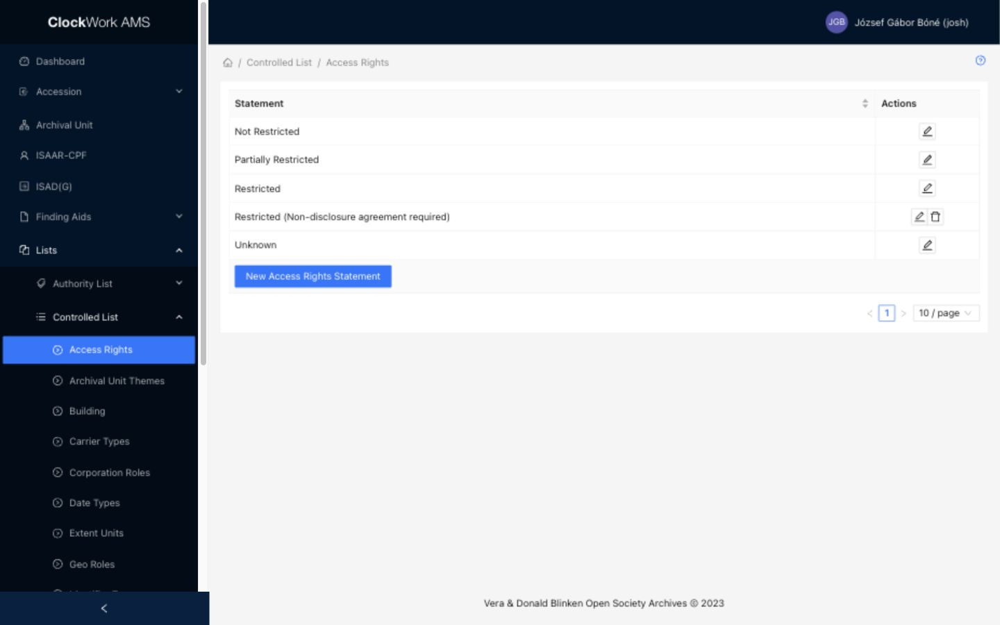

# Controlled Lists

Controlled Lists provide the standardized values used by select fields throughout AMS. Access requires the **Controlled Lists** group.

*Access Rights is representative of the Controlled List editors available from the Lists menu.*

## Available Controlled Lists

The table below shows where each list is used and what its values control in the current AMS interface.

| Controlled List | Used in Forms and workflows | What the values control |
|---|---|---|
| Access Rights | [Folder / Item Form - Basic Metadata](../archival-description/finding-aids.md#basic-metadata-tab), Folder / Item Quick Edit and Table View; read-only display in [ISAD(G) Form - Required Values](../archival-description/isad-g.md#required-values-tab) | Defines the access state or statement associated with descriptive records. The Folder / Item editors expose the applicable Not Restricted and Restricted choices, with the [documented request and Catalog effects](../archival-description/finding-aids.md#access-rights-effects). |
| Archival Unit Themes | [Archival Unit Form](../archival-description/archival-units.md#archival-unit-form) for Fonds, Subfonds, and Series | Supplies the reusable Theme values that can be assigned to any level of the Archival Unit hierarchy. |
| Buildings | [Accession Form](../archival-description/accession-records.md#fields) **Building** field; [Master Location Register](mlr.md#edit-a-location-record) location rows and Building filter | Identifies the repository building in which accessioned material or MLR holdings are physically located. |
| Carrier Types | [Container Form](../archival-description/finding-aids.md#container-form); Master Location Register records; Digitization filters | Identifies the physical carrier or container type. A Carrier Type can also store dimensions and the JasperReports template used by [Label Print](../archival-description/finding-aids.md#label-print). |
| Corporation Roles | [Folder / Item Form - Contributors](../archival-description/finding-aids.md#contributors-tab), **Contributors (Organisations)** rows | Qualifies how a linked corporation or organisation contributed to or is associated with the material. |
| Date Types | [Folder / Item Form - Basic Metadata](../archival-description/finding-aids.md#basic-metadata-tab), repeatable **Dates** rows | Identifies the meaning or function of each additional date or date range. |
| Extent Units | [ISAD(G) Form - Identity](../archival-description/isad-g.md#identity-tab) and [Folder / Item Form - Extra Metadata](../archival-description/finding-aids.md#extra-metadata-tab) | Supplies measurement units for structured Extent rows, paired with an extent number. |
| Geo Roles | [Folder / Item Form - Contributors](../archival-description/finding-aids.md#contributors-tab), **Additional Countries** and **Additional Places** rows | Qualifies the relationship between the material and an associated country or place. |
| Identifier Types | [Folder / Item Form - Extra Metadata](../archival-description/finding-aids.md#extra-metadata-tab), repeatable **Identifiers** rows | Identifies the system, category, or purpose of each additional identifier. |
| Keywords | [Folder / Item Form - Subjects](../archival-description/finding-aids.md#subjects-tab), **Keywords** field | Supplies controlled subject terms used to improve description and discovery. Keywords can also be created or edited from the field through [Select with Add and Edit](../getting-started/special-form-fields.md#select-with-add-and-edit). |
| Language Usages | [Folder / Item Form - Extra Metadata](../archival-description/finding-aids.md#extra-metadata-tab), repeatable **Languages** rows | Qualifies how each selected language is used in the material. |
| Nationalities | [Researcher Form](../reference-services/researchers-and-visits.md#researcher-form), **Citizenship** field | Supplies the standardized citizenship/nationality value stored with a researcher. In the AMS administrative form this value is displayed read-only. |
| Person Roles | [Folder / Item Form - Contributors](../archival-description/finding-aids.md#contributors-tab), **Contributors (People)** rows | Qualifies how a linked person contributed to or is associated with the material. |
| Primary Types | [Folder / Item Form - Basic Metadata](../archival-description/finding-aids.md#basic-metadata-tab), Folder / Item Quick Edit and Digitization filters | Identifies the main type of a Folder / Item record and supports filtering digitization work by that type. |
| Reproduction Rights | [ISAD(G) Form - Required Values](../archival-description/isad-g.md#required-values-tab), **Reproduction rights** field | Supplies the controlled statement describing conditions governing reproduction. |
| Restriction Reasons | [ISAD(G) Form - Required Values](../archival-description/isad-g.md#required-values-tab), **Rights restriction reason** field | Identifies why access to the described material is restricted. |

Most Controlled List editors maintain the label displayed by these fields. Carrier Types contain additional operational configuration, while Access Rights and Reproduction Rights store statements used in archival descriptions.

## Working with Controlled Lists

Search before creating a value and reuse an existing term whenever it has the intended meaning. Use Edit to correct or maintain a shared value. Delete is available only when AMS considers the record removable.

Controlled values can be created or edited from their own list screens. Some forms also expose them through a [Select with Add and Edit](../getting-started/special-form-fields.md#select-with-add-and-edit) field.

!!! warning "Controlled values are shared"
    Renaming or deleting a value can change how linked records display or validate throughout AMS. Confirm the intended terminology, ownership, and downstream use before changing a Controlled List.
