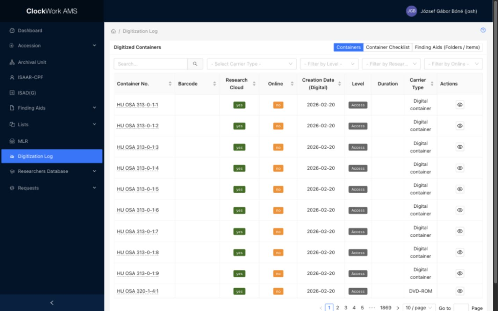

# Digitization Log

The **Digitization Log** is available to every signed-in user. It is a read-only overview of digitized archival materials and brings together container data, Folder / Item descriptions, access-copy availability, and technical metadata.

*The Digitization Log landing screen.*

The log has three views:

- **Containers** lists digital versions connected to whole physical containers.
- **Container Checklist** identifies barcoded containers for quality-control follow-up.
- **Finding Aids (Folders / Items)** lists digitized materials connected directly to Folder / Item records.

## Levels of digitization

Digitization is recorded at one of two descriptive levels. The appropriate level depends on the physical carrier and on the useful granularity of the content.

| Level | Typical materials | Relationship between the description and digital content |
| --- | --- | --- |
| **Container** | Audiovisual carriers such as VHS tapes, audio tapes, and Betacam SP tapes | The complete carrier is digitized as one unit. A container may hold several materials described by separate Folder / Item records, but the resulting digital content is not necessarily divided into a separate file for every description. |
| **Folder / Item** | Textual records and still images | The digital version is connected directly to the Folder / Item record that describes the digitized material. |

The **Digital Copies** indicators in the [Container List and Folder / Item List](../archival-description/finding-aids.md#container-list) show the same distinction. For example, a Folder / Item may indicate that its digital copies are recorded on its parent container instead of on the individual record.

## Master files, access copies, and availability

A digital version has a **Level**:

- **Master** identifies a preservation master produced or registered by the digital preservation workflow.
- **Access Copy** identifies a derivative intended for discovery, research, or delivery.

Where an access copy is made available depends on the material's access rights, technical specifications, and the terms of the donor agreement.

| Availability | Meaning |
| --- | --- |
| **Online** | The access copy is available with the public record in the Blinken OSA [Archival Catalog](https://catalog.archivum.org/). |
| **Research Cloud** | The access copy is available for research use but is not public in the Catalog. |
| **In-house only** | Restricted material remains on the Archivum's internal storage servers and is not exposed through the Catalog or Research Cloud. |

The **Research Cloud** is a SharePoint-based document library used to store access copies and to share selected materials directly with researchers. An availability marker describes where the workflow has registered an access copy; it does not itself replace the access-rights information in the archival description or the donor agreement.

!!! important "Digitization data is populated automatically"
    Digital-version records and their **Online** and **Research Cloud** markers are created or updated by the automated digital preservation workflows. Users do not set these markers in the Digitization Log. If a marker, filename, date, or technical-metadata value appears to be incorrect, report the discrepancy to the staff responsible for the preservation workflow instead of trying to correct it as descriptive metadata.

## Containers

The **Containers** view lists each registered digital version connected at container level. Because a container may have both a master and an access copy, the same container can appear in more than one row.

### Filters

| Filter | Use |
| --- | --- |
| Search | Searches the Archival Unit reference code and container barcode. |
| Carrier Type | Limits the list to a physical carrier type, such as VHS or audio tape. |
| Level | Limits the list to **Access** or **Master** digital versions. |
| Research Cloud | Shows versions marked as available or unavailable in the Research Cloud. |
| Online | Shows versions marked as available or unavailable online in the Catalog. |

### Columns

| Column | Description | Sortable |
| --- | --- | --- |
| Container No. | Archival reference and container number. Select it to open the related Container List in a new browser tab. | Yes |
| Barcode | The identifier attached to the physical carrier or container. | Yes |
| Research Cloud | Whether this digital version is registered as available in the Research Cloud. | Yes |
| Online | Whether this digital version is registered as available in the public Catalog. | Yes |
| Creation Date (Digital) | Date on which the digital-version record was created. | Yes |
| Level | Whether the row represents a master or an access copy. | No |
| Duration | Duration extracted from the technical metadata of an audio or video stream, when available. | No |
| Carrier Type | The physical type of the source carrier or container. | Yes |

### Row action

Select  **View** to open the technical metadata registered for that digital version. The metadata is displayed in a read-only structured view. AMS reports when no technical metadata is available.

## Container Checklist

Audiovisual materials are identified by barcode at container level. The **Container Checklist** is a quality-control tool for the Audiovisual department: it helps staff find barcoded carriers for which the automated workflow has not registered a digital object, so the absence of an access copy in both the Catalog and Research Cloud can be investigated.

Use **Search** to find an Archival Unit reference code or barcode, or filter the queue by **Carrier Type**. The table shows the **Container No.**, **Barcode**, **Research Cloud**, **Online**, and **Carrier Type**. Select a container number to open its Container List and inspect the associated Folder / Item descriptions.

!!! note "Current checklist criterion"
    In the current AMS implementation, the checklist includes a barcoded container only when it has **no digital-version record at all**. It is therefore an initial missing-registration check. A container that already has a registered master or another digital version does not appear in this queue, even if a particular access-copy destination still needs investigation.

The **Research Cloud** and **Online** values in this view are shown as **no** because the checklist contains containers for which no digital version has yet been registered. The checklist itself does not create an access copy or change either marker.

## Finding Aids (Folders / Items)

The **Finding Aids (Folders / Items)** view lists digitized materials whose digital version is connected directly to a Folder / Item record. It is most commonly used for textual materials and still images digitized at that descriptive level.

### Filters

| Filter | Use |
| --- | --- |
| Search | Searches the Folder / Item archival reference code and title. |
| Primary Type | Limits the list by the record's controlled Primary Type. |
| Digital Version | Filters by whether a digital version is registered. |
| Research Cloud | Filters by Research Cloud availability. |
| Online | Filters by online Catalog availability. |

### Columns

| Column | Description | Sortable |
| --- | --- | --- |
| Reference No. | Archival reference code of the Folder / Item record. | Yes |
| Digital Version | Whether a digital version is registered for the record. | Yes |
| Research Cloud | Whether an access copy is registered as available in the Research Cloud. | Yes |
| Online | Whether an access copy is registered as available in the public Catalog. | Yes |
| Creation Date (Digital) | Date associated with creation of the digital-version record. | Yes |
| Primary Type | Controlled type assigned to the Folder / Item description. | Yes |

### Row action

Select  **View** to inspect the technical metadata registered for the Folder / Item's digital version. The information is read-only.

## Recommended quality-control checks

- Confirm that the barcode identifies the intended physical carrier and that the linked Archival Unit, container, and Folder / Item descriptions are correct.
- Check whether digitization has been recorded at the expected level: container or Folder / Item.
- Compare filenames and technical metadata with the preservation-workflow or ingest report.
- Confirm that **Online** and **Research Cloud** availability agrees with the donor agreement and the material's access rights.
- Investigate entries in **Container Checklist**; the presence of a barcode alone does not mean that a digital version or access copy has been registered.
- Escalate missing or inconsistent automatically generated markers to the preservation-workflow maintainers.
