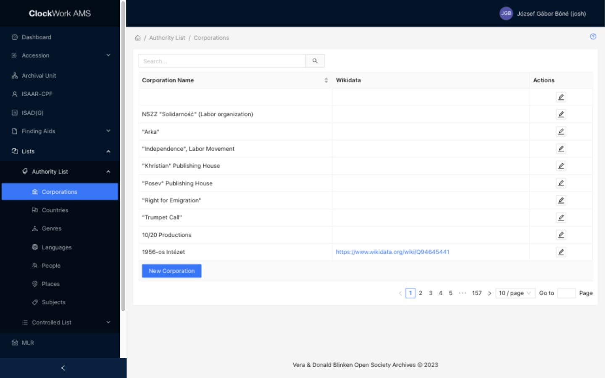

# Authority Lists

Authority Lists provide reusable names and descriptive terms that can be linked to records throughout AMS. Access requires the **Authority Lists** group.

*Corporations is representative of the Authority List tables available from the Lists menu.*

Search for an existing value before creating a record. When correcting a spelling, adding an identifier, or connecting an external authority, edit the existing record rather than creating a near-duplicate.

## Available Authority Lists

| Authority List | Main purpose and metadata |
|---|---|
| Corporations | Names organisations and corporate bodies. Records can include other forms of name, Wikidata and Wikipedia connections, and another external URL. |
| Countries | Provides country names and ISO alpha-2 and alpha-3 codes, with optional Wikidata enrichment. |
| Genres | Provides documentary forms and genres. Records can be connected to LCSH, Wikidata, Wikipedia, and another external URL. |
| Languages | Provides language names and ISO 639-1, ISO 639-2, and ISO 639-3 codes, with authority, Wikipedia, and Wikidata connections. |
| People | Names people using first and last name fields. Records can include other forms of name, Wikidata enrichment, and another external URL. |
| Places | Provides geographic place names, with Wikidata enrichment and another external URL. |
| Subjects | Provides subject terms. Records can be connected to LCSH, Wikidata, Wikipedia, and another external URL. |

Authority records are used by fields such as Contributors, Spatial Coverage, Subjects, Languages, and Form/Genre. Editing a shared authority record can therefore change how it is displayed everywhere it is linked.

## Wikidata integration

Authority forms with Wikidata support include a **WikiData** tab or Wikidata selection area. This integration connects the local authority record to an entity in the [Wikidata database](https://www.wikidata.org/) and stores a curated copy of the relevant external information with the AMS record.

### Search and select a Wikidata entry

1. Enter or verify the authority record's principal name, such as a person's name, corporation name, country, place, genre, language, or subject.
2. Open the **WikiData** tab when the form provides one.
3. Select **Search**. AMS searches Wikidata using the name entered in the authority form.
4. Review the result table. The Wikidata ID is a link to the external entity, and the Name column helps distinguish entities with similar names.
5. Select **Select entry** beside the correct result. Its Wikidata ID appears as the **Selected Identifier**.
6. Submit the authority form to save the identifier. As the record is saved, AMS downloads a curated Wikidata snapshot and stores it in the database with the authority record.

!!! important "Select the entity, then submit the form"
    **Select entry** chooses the Wikidata identifier in the open form. The authority record and downloaded Wikidata information become persistent when the form is submitted. Closing the form without submitting does not save the newly selected identifier.

The stored snapshot can include the entity's title and description, Wikidata and VIAF identifiers, selected properties, an image, geographic data, and Wikipedia links, where Wikidata supplies them. Saving an authority record with a Wikidata identifier refreshes this locally stored information when Wikidata returns a usable result.

### Information card in AMS and the Archival Catalog

After a Wikidata connection has been saved, an information card is displayed the next time the authority record is opened in AMS. The same stored information is used for the card displayed when a user selects the corresponding facet in the Archival Catalog.

The card adapts to the type of authority:

- **People:** a small portrait is displayed when Wikidata or Wikimedia Commons provides an image.
- **Countries:** a map can display the country's border using GeoJSON geographic-shape data when it is available.
- **Places:** a map marker is displayed when Wikidata provides latitude and longitude coordinates.
- **Other authorities:** the card can display the available description, identifiers, selected properties, image, or external links supported by that entity.

AMS also extracts the principal Wikipedia URL and available language-specific Wikipedia links from the Wikidata entry. The card initially displays a short selection of these links and provides **Show More** when additional language editions are available.

Because the information is cached with the authority record, AMS and the Catalog can display it without requesting the complete entity from Wikidata every time the card is opened.

!!! warning "Verify the external match"
    Similar names can refer to different people, organisations, places, or subjects. Open the Wikidata result and confirm its description and identity before selecting it. Choosing the wrong entity can attach an incorrect portrait, map, description, properties, and Wikipedia links to the AMS record and its Catalog facet.

## Duplications

The **Duplications** tab helps identify and merge authority records that may describe the same entity. It is currently available only when editing an existing **People** record from the Authority List. Support for **Corporations** and **Places** is planned, but those record types do not yet provide this tab or a merge API.

The table displays potential matches with their **Name**, calculated **Similarity** percentage, **Authority URL**, **Wikidata** identifier, and available merge actions. The currently open Person is excluded from its own results. By default, the API returns the ten highest-ranked candidates that meet a minimum similarity score of 20 percent.

### How potential duplicates are calculated

The DRF API compares the open Person's combined first and last name with other People records. Names are normalized for comparison: accents are folded to ASCII, punctuation is removed, whitespace is normalized, and the text is converted to lowercase.

The calculation adapts to the form of the name:

- For a **single-word name**, AMS first finds candidates through whole-word and first-name or last-name prefix matches. It ranks them with fuzzy full and partial string comparison and gives small boosts to exact or prefix token matches.
- For a **multi-word name**, AMS uses character-trigram SimHash and last-name matching to build a manageable candidate set. It then combines character n-gram TF–IDF similarity with fuzzy string similarity, with small boosts for matching initials and exact last-name tokens.

Each candidate receives a percentage from 0 to 100 and the results are ordered from the strongest calculated match downward.

!!! note "Similarity is a review aid"
    A high percentage does not prove that two records identify the same person, and a lower percentage can still represent a genuine variant or transliteration. Compare the full names, Wikidata identifiers, authority URLs, other forms of name, and linked records before merging.

### Merge actions

| Action | Record kept | Record deleted | Effect |
|---|---|---|---|
| Merge | The Person currently open in the form | The candidate displayed in the Duplications table | Redirects the candidate's Finding Aids references to the open Person, then deletes the candidate. |
| Keep This | The candidate displayed in the Duplications table | The Person currently open in the form | Redirects the open Person's Finding Aids references to the candidate, deletes the open Person, and closes the obsolete form. |

Both actions display a confirmation dialog. On confirmation, the API updates every Finding Aids relationship in which the deleted Person is used either as a **Subject (People)** value or as a **Contributors (People)** value. The operation runs in a single database transaction: if any part fails, the reference changes and deletion are rolled back together.

!!! danger "Merging permanently deletes one authority record"
    The merge operation redirects links but does not combine the authority metadata of the two People records. Names, other forms of name, Wikidata and Wikipedia connections, authority URLs, and other values belonging only to the deleted record are not copied automatically. Before merging, add any information that must be retained to the record you intend to keep. Carefully verify which button preserves which record; the deleted record cannot be restored from this form.

## Other external authority connections

Depending on the Authority List, a form may also offer an **Authority Link (LCSH)** tab, a separate **Wikipedia Link** search, ISO codes, other forms of name, or a free **Other URL** field. Use the dedicated field for each source so AMS can identify and display the connection correctly.

## Governance

!!! warning "Authority records are shared"
    Renaming, merging, or deleting an Authority List value can affect many linked descriptive records. Confirm the identity, ownership, and downstream use of a value before making structural changes.
