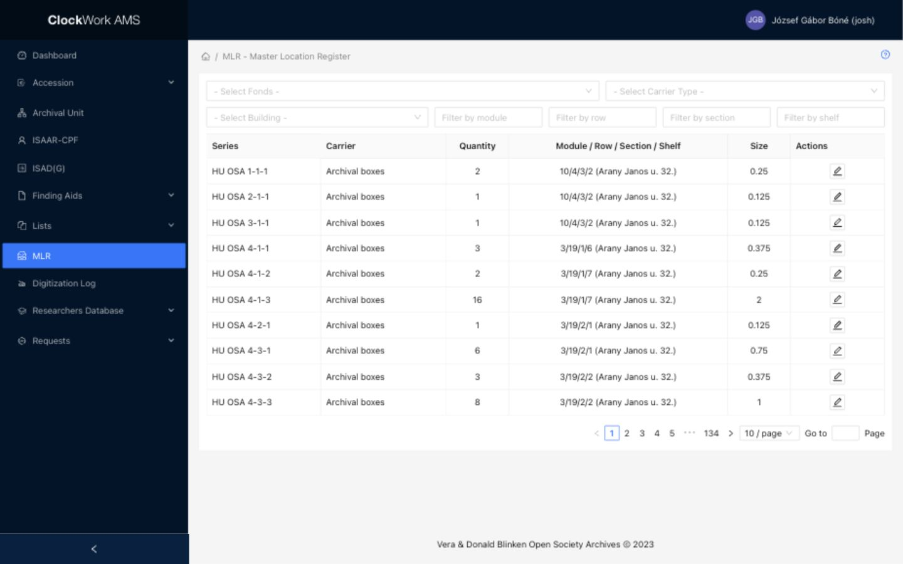

# Master Location Register

The **Master Location Register (MLR)** records where archival material is stored. Access requires the **MLR** group.

*The MLR list combines descriptive filters with physical-location filters.*

The list displays the series, carrier type, quantity, combined module/row/section/shelf location, and size. Filters help locate records by their descriptive or storage attributes.

## Automatic creation and physical-storage logic

AMS creates and maintains MLR records from the containers recorded in [Finding Aids - Folders / Items](../archival-description/finding-aids.md). An MLR record represents one combination of:

- a **Series**; and
- a **Carrier Type** used by at least one container in that Series.

When the first container of a particular Carrier Type is created under a Series, AMS automatically creates the corresponding MLR record. Creating further containers of the same type under that Series does not create duplicate MLR records; instead, those containers contribute to the existing record's calculated quantity and size. Creating a container with a different Carrier Type creates another MLR record for that Series.

!!! note "MLR records are synchronized with containers"
    Staff do not create the Series–Carrier Type relationship manually in MLR. It is created when the corresponding container is created. If the last container for that Series–Carrier Type combination is deleted, or a container is changed so that the old combination becomes empty, AMS automatically removes the empty MLR record.

This structure is necessary because material in the Archivum's storage facilities is arranged according to its physical form and size. Different Carrier Types may require different rooms, shelving, environmental conditions, or storage furniture. For example, VHS tapes are stored separately from archival boxes even when both belong to the same archival Series.

The **Quantity** shown in MLR is the current number of containers in the Series with that Carrier Type. The estimated **Size** in linear metres is calculated from that quantity and the width configured on the [Carrier Type](controlled-lists.md#available-controlled-lists). The storage locations themselves are assigned in the MLR record.

## Edit a location record

1. Open **MLR**.
2. Filter for the series or storage position.
3. Select **Edit** on the matching record.
4. Confirm the series and carrier type.
5. Update the location entries or notes as required. Quantity and Size are calculated from the matching containers and cannot be edited here.
6. Save, then verify the combined location displayed in the list.

Use one consistent interpretation of building, module, row, section, and shelf. Physical moves should be reflected in AMS as part of the same controlled workflow used to move the material.
