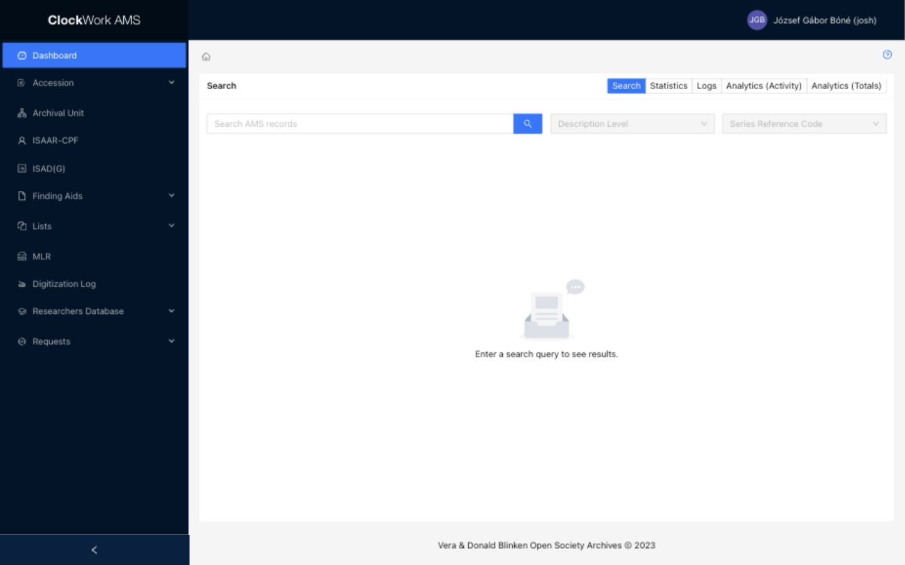
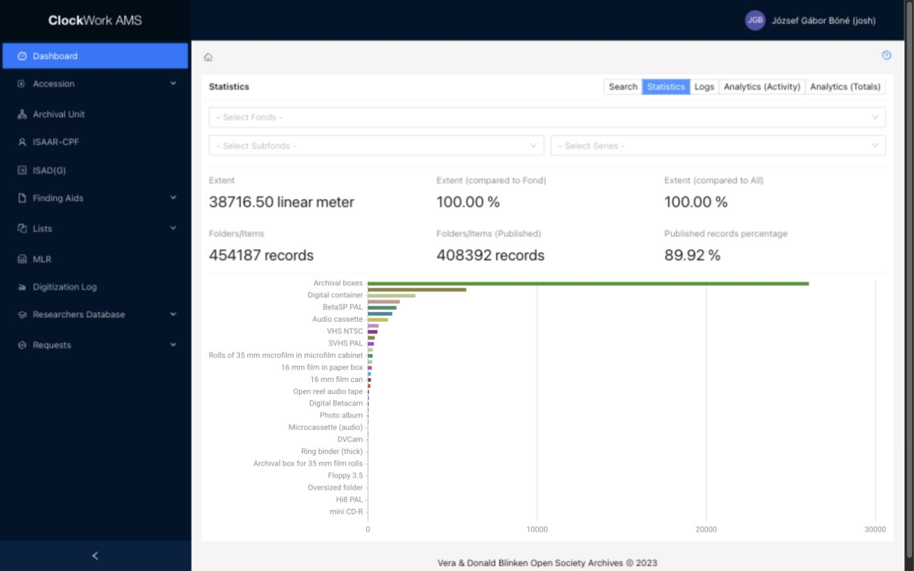
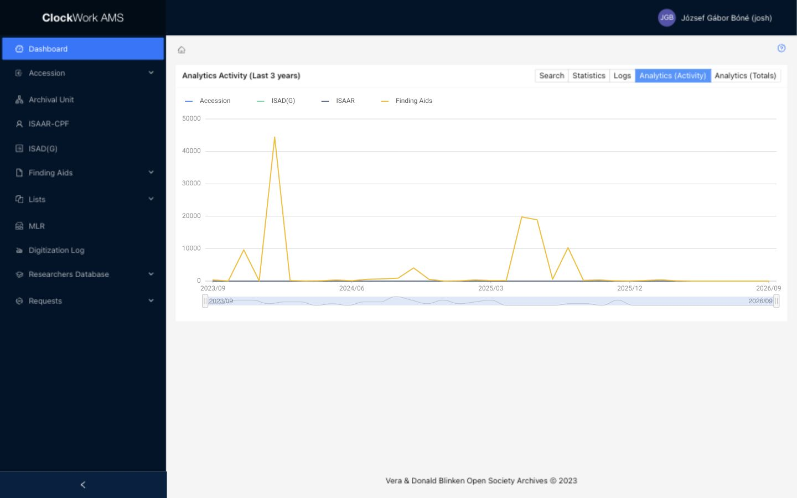
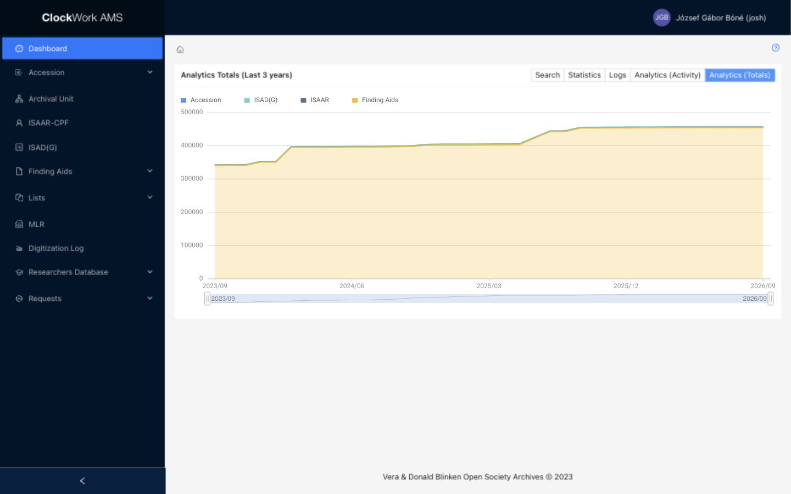

# Dashboard

The Dashboard is the AMS starting page. It provides full-text discovery, collection-size statistics, recent activity logs, and record-growth analytics. It is available to every signed-in user.

*Select a tab at the top of the Dashboard to change the displayed view.*

!!! info "No record changes"
    The Dashboard is read-only. Searching, changing tabs, and applying Dashboard filters do not modify or publish records.

## Search

**Search** performs a full-text search across the main metadata held in AMS. It searches:

- Accession records;
- ISAD(G) records; and
- Folder / Item Finding Aids entities.

Searchable metadata includes:

- title;
- archival reference code; and
- description fields.

1. Select the **Search** tab.
2. Enter one or more search terms in **Search AMS records**.
3. Select the search button.
4. Optionally narrow the results by **Description Level** or **Series Reference Code**.
5. Open a result to review the corresponding AMS record.

Search results can contain several record types. Check the record type and reference code before opening or acting on a result.

## Statistics

**Statistics** provides an overview of the size and publication state of the archival collection. It calculates:

- total linear metres;
- number of Folder / Item records;
- number of published entities; and
- percentage of records that are published.

Filter the figures by **Fonds**, **Subfonds**, or **Series** to examine a particular part of the archival hierarchy. The lower-level filters depend on the higher-level selection: choose a fonds before narrowing to one of its subfonds or series.

Statistics are calculated from current AMS data. They change as descriptive records, extents, and publication states change.

*The Statistics view combines hierarchy filters, headline measures, and carrier-type totals.*

## Logs

**Logs** shows the ten most recent actions for each supported module. Use it to review the latest record activity without opening every module separately.

The log is an activity summary rather than a complete audit report. If an action requires investigation, open the affected record or the module's full audit information where available.

## Analytics (Activity)

**Analytics (Activity)** displays a trend graph of the number of entries created in each month. Use it to compare cataloguing activity over time and identify increases or decreases in record creation.

The graph measures newly created entries; it does not represent every edit or the total amount of work performed during a month.

*Analytics (Activity) charts monthly record creation during the last three years.*

## Analytics (Totals)

**Analytics (Totals)** shows how the total number of records of each type has changed during the last three years. The chart includes:

- Accession records;
- ISAD(G) records;
- ISAAR-CPF records; and
- Finding Aids records.

Unlike **Analytics (Activity)**, which counts entries created per month, **Analytics (Totals)** shows the accumulated record totals over time.

*Analytics (Totals) compares the accumulated number of records by type during the last three years.*
