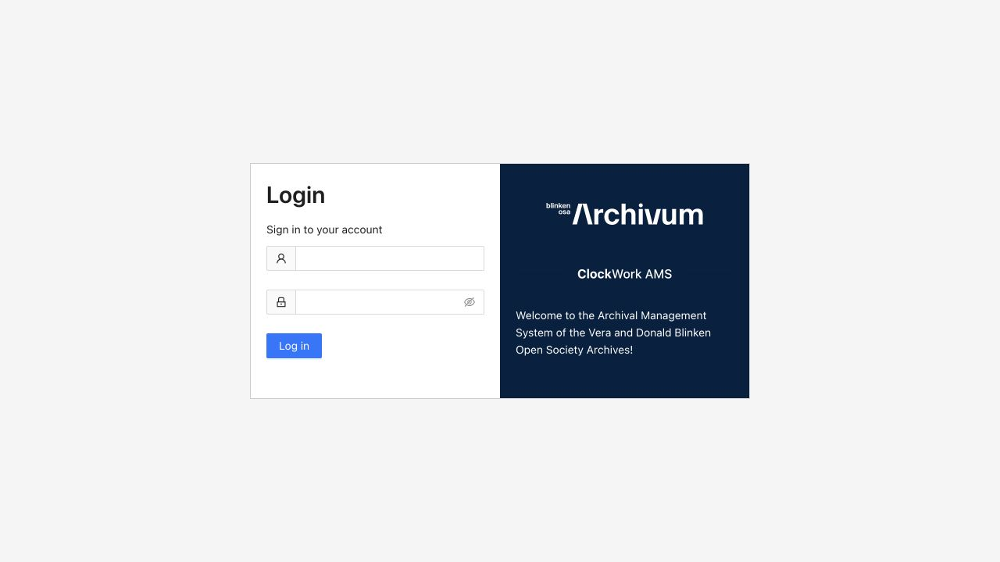
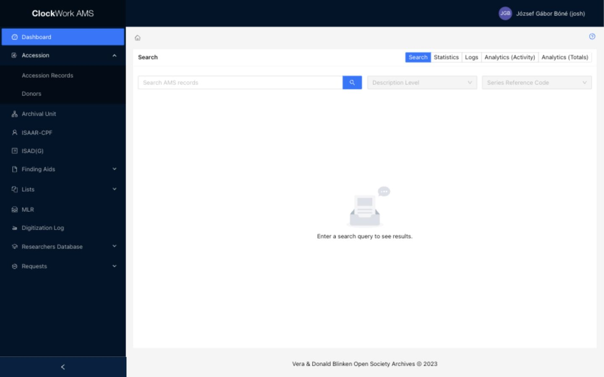

# Sign in and navigate

## Sign in

1. Open the AMS web address supplied by your administrator.
2. Enter your account credentials on the **Login** page.
3. Select **Sign in**.

*The AMS login page. Enter your username and password on the left.*

After authentication, AMS opens the Dashboard. If authentication succeeds but a module is unavailable, your account probably lacks the corresponding access group.

## Main navigation

Use the menu to open a module. Menu groups expand to show related pages, such as **Accession Records** and **Donors** under **Accession**, or the three researcher pages under **Researchers Database**.

*An expanded menu reveals the pages in that module.*

Breadcrumbs above the page content show your current location. Use them to return to a parent page without relying on the browser Back button.

## Contextual help

Pages and form tabs may include a help link. Help is contextual: for example, each ISAD(G) or finding-aid tab can open the relevant manual topic.

## Your profile

Open **Profile** from the user menu to review your account data or change your password. Password requirements are set by the AMS service and may differ by deployment.

## Sign out

Use the account menu to sign out when you finish, especially on a shared workstation.
