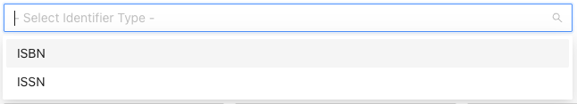
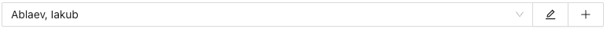
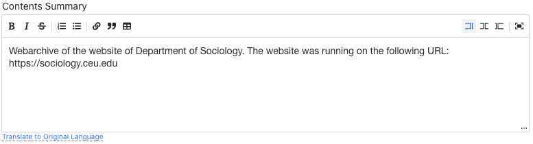
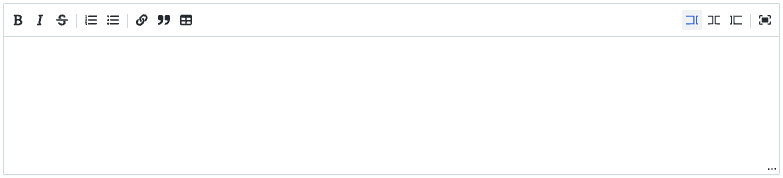

# Special form fields

AMS forms include reusable controls for linked records, dates, multilingual metadata, formatted text, and repeated values. Understanding these controls helps prevent duplicate records and unintended changes.

## Select fields

A Select field chooses a value from AMS rather than accepting unrestricted text. Open the field and begin typing to search its available records or controlled values. The search normally starts after several characters, so enter enough of the name to distinguish the intended result.

Select the matching result to link it to the current record. Use the clear control only when the relationship should be removed.

<figure class="ams-component-figure" markdown>
  
  <figcaption>A Select field showing its search box and available choices.</figcaption>
</figure>

## Select with Add and Edit

A **Select with Add and Edit** field combines a searchable selector with two buttons:

- the <svg viewBox="64 64 896 896" focusable="false"><path d="M257.7 752c2 0 4-.2 6-.5L431.9 722c2-.4 3.9-1.3 5.3-2.8l423.9-423.9a9.96 9.96 0 000-14.1L694.9 114.9c-1.9-1.9-4.4-2.9-7.1-2.9s-5.2 1-7.1 2.9L256.8 538.8c-1.5 1.5-2.4 3.3-2.8 5.3l-29.5 168.2a33.5 33.5 0 009.4 29.8c6.6 6.4 14.9 9.9 23.8 9.9zm67.4-174.4L687.8 215l73.3 73.3-362.7 362.6-88.9 15.7 15.6-89zM880 836H144c-17.7 0-32 14.3-32 32v36c0 4.4 3.6 8 8 8h784c4.4 0 8-3.6 8-8v-36c0-17.7-14.3-32-32-32z"></path></svg> **Edit** (pencil) button opens the currently selected related record for editing; and
- the <svg viewBox="64 64 896 896" focusable="false"><path d="M482 152h60q8 0 8 8v704q0 8-8 8h-60q-8 0-8-8V160q0-8 8-8z"></path><path d="M192 474h672q8 0 8 8v60q0 8-8 8H160q-8 0-8-8v-60q0-8 8-8z"></path></svg> **Add** (plus) button opens a blank form for creating a related record.

<figure class="ams-component-figure" markdown>
  
  <figcaption>The complete Select with Add and Edit component with a value selected.</figcaption>
</figure>

The pencil is available only after a value has been selected. Both forms open in a drawer without leaving the parent record. When the related record is submitted, AMS refreshes the available choices and selects the created or edited record in the parent field.

!!! warning "The related record is saved separately"
    Submitting the drawer creates or updates the related record immediately. Closing the parent form afterward does not undo that related-record change. Review the drawer carefully before submitting it and avoid creating a duplicate merely because a value is not visible in the initial list.

When you only need an existing value, search and select it without using the plus button.

## Date fields

AMS uses two kinds of date input:

- **Date picker** fields select a complete calendar date.
- **Partial-date text** fields accept `YYYY`, `YYYY-MM`, or `YYYY-MM-DD` when only part of a date is known.

Use the most precise date supported by the source. Do not invent a month or day to complete an uncertain date. If a form displays a format instruction below the field, follow that instruction exactly.

A pair of **From** and **To** fields represents a date range. Enter the earlier date in **From** and the later date in **To**; leave **To** empty when the record represents a single date or no reliable end date is known.

## Original Locale and translated fields

Forms with multilingual descriptive metadata use **Original Locale** to identify the language of the original text. Select the locale before entering or translating paired original-language fields.

A translated pair usually contains an English field and an **Original Language** field. Keep the source text and its translation in the correct fields. The locale applies to the original-language value, not to the English value.

Some paired text fields can use DeepL-assisted translation. When an Original Locale is selected, a source field contains text, and its paired target field is empty, AMS can display one of these actions:

- **Translate to English**; or
- **Translate to Original Language**.

AMS asks for confirmation before sending the field to the translation service. The returned translation is inserted into the empty paired field.

<figure class="ams-component-figure" markdown>
  
  <figcaption>A populated field offering DeepL-assisted translation into the selected original language.</figcaption>
</figure>

!!! warning "Review automatic translations"
    DeepL output is a draft. Check names, archival terminology, dates, abbreviations, and historical context before submitting the form. The translation action fills the field but does not save the parent record until you select **Submit**.

## Formatted Text fields

A **Formatted Text** field stores its content using Markdown syntax. Markdown adds structure and emphasis with plain-text characters. When the record is published, the Blinken OSA Archival Catalog interprets this Markdown and displays the text with the corresponding formatting rather than showing the formatting characters.

The field toolbar provides common Markdown operations, including bold and italic text, strikethrough, numbered and bulleted lists, links, quotations, and tables. You can use the toolbar or enter the Markdown syntax directly.

<figure class="ams-component-figure" markdown>
  
  <figcaption>The Formatted Text editor provides formatting actions above the text-entry area.</figcaption>
</figure>

| Intended formatting | Markdown example |
|---|---|
| Bold | `**important text**` |
| Italic | `*title or emphasis*` |
| Strikethrough | `~~removed text~~` |
| Bulleted list | Begin each item with `- ` |
| Numbered list | Begin each item with `1. `, `2. `, and so on |
| Link | `[link text](https://example.org)` |
| Quotation | Begin the paragraph with `> ` |

Write normal prose without Markdown characters when no formatting is needed. Leave a blank line between paragraphs and check that list markers, link brackets, and emphasis characters are paired correctly.

!!! important "Formatting becomes public catalog content"
    For a published record, the rendered result is visible in the Archival Catalog. Review the wording, links, lists, and formatting before submitting or publishing. Markdown changes presentation only; do not use formatting as a substitute for entering information in the correct metadata field.

## Repeatable field groups and subforms

Repeatable groups allow a record to contain more than one value of the same kind, such as identifiers, dates, extents, languages, creators, contributors, subjects, locations, accession items, or related descriptions.

Select **Add** or the plus control to append another row or subform. Enter one distinct value per row. Use the row's remove control to discard an unnecessary entry before submitting the parent form.

Before submission:

- remove empty rows;
- check that the same value has not been added twice;
- preserve the intended order where the order carries meaning; and
- review each row's role, type, language, or other qualifier.

Inline repeatable rows are saved together with the parent form. If a repeated field opens a separate related-record drawer, follow the [Select with Add and Edit](#select-with-add-and-edit) guidance because that related record may be saved independently.
