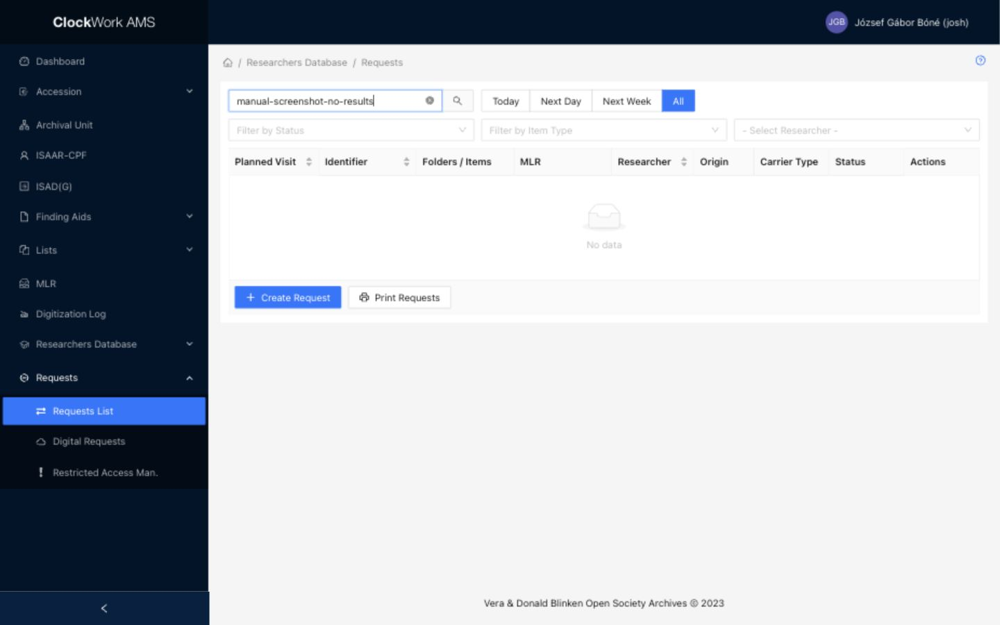
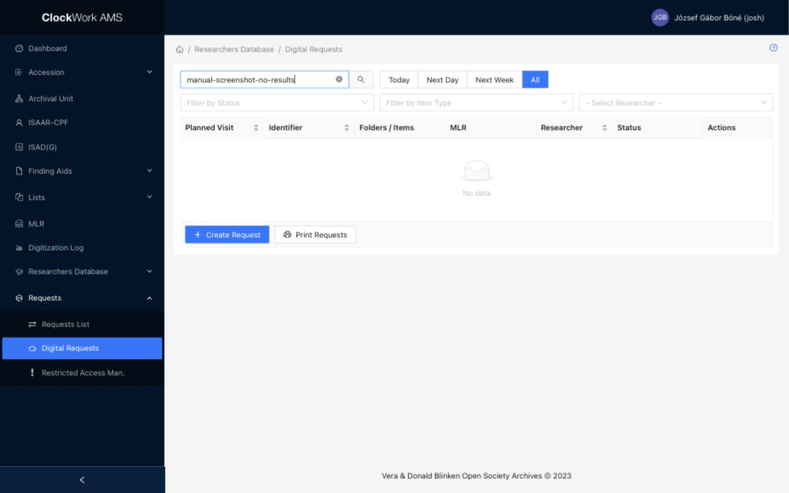
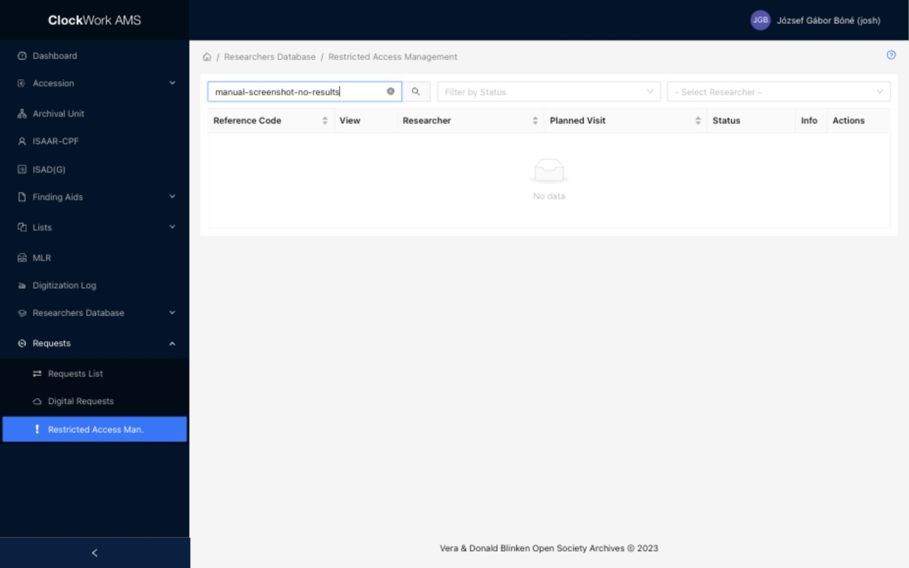

# Requests and Restricted Access Management

The **Requests** module contains three operational lists:

- **Requests List** is used by Reference Service Desk staff to retrieve, serve, return, and reshelve requested materials.
- **Digital Requests** is the corresponding queue for materials with registered digital copies.
- **Restricted Access Management** is used by members of the **Restricted Decision Makers** group to decide whether a researcher may use a restricted Folder / Item.

The **Research** group can use Requests List and Digital Requests. Restricted Access Management requires membership in the **Restricted Decision Makers** group.

## Requests submitted through the Archival Catalog

An approved researcher can request materials through the Blinken OSA [Archival Catalog](https://catalog.archivum.org/). The Catalog verifies the researcher's email address and virtual card number. A researcher whose registration is still **New** or has been **Suspended** cannot submit a request.

A request records a planned visit or access date and one or more requested materials. Archival requests are managed at container level in AMS: one table row represents a container, while the **Folders / Items** column identifies the individual Folder / Item records requested from that container. Analog materials are also served at container level, which means that researchers receive the full archival box rather than only the requested Folder / Item; staff must therefore remove any restricted, rejected, or otherwise non-serviceable material before handing over the box.

### Six-container limit and queueing

In one Catalog request, a researcher can request up to **six containers per material type**. The limit is applied separately to:

- textual materials;
- audiovisual materials;
- digital objects;
- library materials; and
- Film Library materials.

The six available processing slots are tracked per researcher and material type. If a researcher submits additional requests while all six slots for a type are occupied, the additional containers receive **In Queue** status. They do not require manual promotion: as containers of the same type complete processing and release slots, AMS automatically moves the next queued containers to **In Processing**.

!!! note "In Processing is labelled Pending in AMS"
    The current Requests List filter and status badge use the label **Pending** for the operational **In Processing** stage. In this manual, **In Processing (Pending)** refers to that same status.

### Requesting restricted material

A Folder / Item is treated as restricted when its **Access Rights** value is **Restricted**. See [Access Rights effects](../archival-description/finding-aids.md#access-rights-effects) for the effect of this field throughout the descriptive hierarchy.

When at least one restricted Folder / Item is added to the request in the Catalog, the **Restricted Content Information** section appears and asks for two additional fields:

| Field | Instruction | Required for restricted material |
| --- | --- | --- |
| Research Subject | Title or topic of the research for which access is requested. | Yes |
| Motivation | Explanation of how the researcher intends to use the restricted content. The Catalog form permits a maximum of 250 characters. | Yes |

The restricted Folder / Item enters AMS with status **New**. Processing of its container is halted at **Waiting for approval** until the required restricted-item decisions have been made.

### Notifications after Catalog submission

Submitting a Catalog request has the following email side effects:

| Recipient | Notification |
| --- | --- |
| Researcher | Receives confirmation of the request. Restricted items are marked **THIS ITEM IS RESTRICTED**, and a warning explains that individual assessment may take additional time. |
| Reference Service Desk | Receives notification of the incoming request. Restricted items are identified in the item list. |
| Restricted Decision Makers | Receives a review notification only when the request contains restricted material. The message includes the restricted items, Research Subject, and Motivation. |

## Requests List

*Requests List combines date shortcuts, workflow filters, researcher selection, item details, and print controls. The documentation screenshot uses a no-results search to protect personal data.*

The list contains both regular and restricted requests. A request item with unresolved restricted content remains visible, but its service workflow is inactive until a decision permits processing or all requested parts have been rejected.

### Filters

| Filter | Use |
| --- | --- |
| Search | Searches researcher first and last names, Archival Unit reference codes, identifiers, other identifiers, titles, and container barcodes. |
| Request Date | Select **Today**, **Next Day**, **Next Week**, or **All**. Next Day means the next working day; from Friday through Sunday it resolves to Monday. Next Week covers the following Monday-to-Monday interval. |
| Status | Filters by **In Queue**, **Pending** (In Processing), **Delivered**, **Returned**, **Reshelved**, or **Served**. |
| Item Type | Filters by **Archival**, **Library**, or **Film Library** origin. |
| Researcher | Limits the list to one approved researcher. |

### Columns

| Column | Description | Sortable |
| --- | --- | --- |
| Planned Visit | Requested visit or access date. | Yes |
| Identifier | For archival material, the Archival Unit reference code and container number. Other origins display their identifier. A **Has Restricted Material** badge means that the archival container contains at least one restricted Folder / Item. | Yes |
| Folders / Items | Individual requested Folder / Item reference codes, with colors indicating restriction and decision status. | No |
| MLR | Storage location or service information. It can also warn that the material appears in another request, is currently used, or is waiting to be reshelved. A digital barcode is shown when applicable. | No |
| Researcher | Researcher's name and email address. | Yes |
| Origin | **Archival**, **Library**, or **Film Library**. **Digital** is appended when a digital version is registered. | No |
| Carrier Type | Physical carrier or container type. | No |
| Status | Current container-level service status or **Waiting for approval**. | No |
| Actions | Edit and Delete controls, when the request is eligible for processing. | No |

### Restricted Folder / Item colors

The **Folders / Items** column shows the actual descriptions requested from the container. Hover over a colored reference code to see its decision status.

| Display | Meaning | Handling consequence |
| --- | --- | --- |
| Transparent background | The Folder / Item is not restricted, or its restriction has been lifted. | It may be served. If the container also carries the **Has Restricted Material** warning, remove any restricted material that must not be handed to the researcher. |
| Red | Restricted and **New**. | Await a Restricted Decision Maker's decision. The request row remains **Waiting for approval**. |
| Green | **Approved**. | The requested Folder / Item may be served subject to any applicable conditions. |
| Green-blue | **Approved for on-site viewing**. | The material may be used only in person in the Reading Room, even if a digital copy exists. |
| Orange | **Rejected**. | Do not provide the Folder / Item. Remove it from the container before serving any approved or unrestricted material from the same container. |
| Blue “missing” badge | The Folder / Item is marked missing. | Investigate its physical status before continuing. |

AMS enables the request workflow only after no requested restricted Folder / Item remains **New**. For example, a container with one approved and one rejected Folder / Item can proceed, but the rejected material must be removed before service. If all requested parts are rejected, there is nothing to serve; AMS moves the physical request item to **Returned** or the digital request item to **Served**.

### Service status workflow

Select the status badge to advance a request item. Later physical-handling stages provide an **Undo** control to move back one stage.

| Status | Meaning and next action |
| --- | --- |
| Waiting for approval | One or more requested restricted Folder / Items still require a decision. The service status cannot advance. |
| In Queue | The six processing slots for this researcher and material type are occupied. AMS automatically promotes queued containers when a slot for the same type becomes available. |
| In Processing (**Pending** in AMS) | The request occupies one of the researcher's six available slots for that material type and is ready for retrieval or digital preparation. Selecting the badge advances a physical request to **Delivered**. Digital delivery follows the Digital Requests workflow. |
| Delivered | The physical material has been processed and prepared for the researcher. Entering this status records the served date and sends the researcher a prepared-material notification. |
| Returned | The material has been returned after use. Entering this status records the return date and releases capacity for the next queued request. |
| Reshelved | The material has been returned to storage. Entering this status records the reshelving date. |
| Served | The digital material has been processed through the delivery workflow. The served and return dates are recorded. |

!!! warning "Status changes take effect immediately"
    Selecting a request status badge advances the workflow without a separate confirmation dialog. Confirm the row and its Folder / Item decisions before selecting the badge. The prepared-material email is sent when a physical item becomes **Delivered** or a digital item becomes **Served**.

### Row actions

| Action | Availability and effect |
| --- | --- |
| Edit | Available only when access is allowed and the request is **In Queue**, **In Processing** (**Pending** in AMS), or **Delivered**. Opens the Request Item Form in a drawer. |
| Delete | Available when access is allowed. After confirmation, permanently deletes the request item. |

### Footer actions

| Action | Effect |
| --- | --- |
| Create Request | Opens the Request Form for a request entered by staff. |
| Print Requests | Opens a printable list of all request items currently **In Processing**—labelled **Pending** in AMS. |

## Request Form

Reference Service Desk staff can create a request in AMS when assistance is required. The form is also used to edit individual request items from the table drawer.

| Form section | Field | Description | Required |
| --- | --- | --- | --- |
| Request | Researcher | Approved researcher for whom the request is being entered. | Yes |
| Request | Request Date | Planned visit or access date. | Yes |
| **Requested Items** | Origin | Select **Archival**, **Library**, or **Film Library** for this requested item. | Yes |
| **Requested Items** | Archival Unit | For an Archival item, select the Series. | For Archival items |
| **Requested Items** | Container | For an Archival item, select a container from the selected Series. This is a dependent select field. | For Archival items |
| **Requested Items** | Identifier | Call number or identifier for a Library or Film Library item. | For Library and Film Library items |
| **Requested Items** | Title | Title of a Library or Film Library item. | For Library and Film Library items |
| **Requested Items** | Quantity | Number of volumes or other quantity information. | For Library and Film Library items |

**Researcher** and **Request Date** apply to the request as a whole. The fields marked **Requested Items** form one repeatable item group; repeat the group to enter several materials in the same request. See [repeatable field groups](../getting-started/special-form-fields.md#repeatable-field-groups).

!!! note "Requests created in AMS"
    Creating a request directly in AMS does not use the Catalog submission workflow and does not send the initial Catalog request-confirmation emails. Staff must ensure that the researcher and request details are correct and communicate separately when required.

## Digital Requests

*Digital Requests shows request items whose archival container or Folder / Item has a registered digital version, together with eligible digital Film Library requests. The screenshot is filtered to avoid displaying researcher information.*

Digital Requests uses the same filters, restricted-item colors, status blocking, Edit action, Delete action, Create Request action, and Print Requests action as Requests List. Its table omits the separate **Origin** and **Carrier Type** columns.

When an eligible digital request is **In Processing** (**Pending** in AMS), select the cloud **Share** button beside its status to start the SharePoint preparation job. AMS displays progress through **Queued**, **Checking files**, **Creating directory**, **Copying files**, **Sending emails**, and **Completed**, or reports the failed step and error.

For archival requests, the job uses access copies that are marked as available in the Research Cloud and have a registered Research Cloud path. For Film Library requests, it locates the corresponding MP4. It creates or reuses a researcher folder in the requested-materials SharePoint library, copies the available files, and does not duplicate files already present. On successful completion, the request becomes **Served**.

!!! warning "Current SharePoint delivery scope"
    In the current implementation, the job prepares the staff-side SharePoint folder and notifies Reference Service Desk staff. Direct sharing of that folder with the researcher and the researcher delivery email are temporarily disabled. A completed job must therefore not be treated by itself as proof that the researcher received access.

## Restricted Access Management

Restricted Access Management is the decision queue for requested Folder / Item records whose current **Access Rights** value is **Restricted**. Each row represents one restricted Folder / Item, not the whole container request.

*Restricted Access Management is shown with a privacy-safe no-results filter.*

### Filters

| Filter | Use |
| --- | --- |
| Search | Searches researcher first and last names, the container's Archival Unit reference code, and container barcode. |
| Status | Filters by **New**, **Approved**, **Rejected**, or **Lifted**. Records approved for on-site viewing can appear in the list but are not currently offered as a separate filter value. |
| Researcher | Limits the list to one approved researcher. |

!!! note "Records included in the current queue"
    The current AMS list includes restricted Folder / Item requests with a planned date on or after **1 January 2025**. A record disappears from this queue if **Lift** changes its Access Rights to **Not Restricted**.

### Columns

| Column | Description | Sortable |
| --- | --- | --- |
| Reference Code | Archival reference code of the requested Folder / Item. | Yes |
| View | Opens the descriptive record in either the public Catalog or the AMS Folder / Item editor. | No |
| Researcher | Researcher's name and email address. | Yes |
| Planned Visit | Requested visit or access date. | Yes |
| Status | **New**, **Approved**, **Approved for on-site**, **Rejected**, or **Lifted**. | No |
| Info | Hover to display the submitted Research Subject and Motivation. | No |
| Actions | Four decision actions, each protected by a confirmation prompt. | No |

### Decision actions and side effects

Decisions apply to the individual requested Folder / Item. **Approve**, **Approve for on-site**, and **Reject** decide only this request and preserve the descriptive record's **Restricted** Access Rights. **Lift** changes the descriptive record itself.

| Action | Request decision | Effect on the Folder / Item record |
| --- | --- | --- |
| Approve | Allows the researcher to use the material, subject to any stated conditions. | Access Rights remains **Restricted**. Later researchers must still request an individual decision. |
| Approve for on-site | Allows use only in person in the Reading Room, including when a digital copy exists. | Access Rights remains **Restricted**. Later researchers must still request an individual decision. |
| Reject | Denies this researcher access to the Folder / Item. | Access Rights remains **Restricted**. |
| Lift | Grants access and permanently changes Access Rights to **Not Restricted**. | The item is removed from Restricted Access Management and appears without restricted highlighting in Requests List. Future requests no longer require a restricted-access decision unless the description is restricted again. |

For OSF- or CEU-related materials that require a Non-Disclosure Agreement, the researcher must receive, complete, and return the agreement before access is provided. Approval or on-site approval in AMS does not by itself replace that requirement.

Every decision action:

- records the decision status;
- records the decision maker's AMS username and the decision date;
- sends a decision email to the researcher; and
- sends a corresponding notification to Reference Service Desk staff.

Because selecting a different action later overwrites the current decision and sends another set of notifications, verify the record, Research Subject, Motivation, and intended action before confirming.

!!! danger "Lift changes descriptive metadata"
    **Lift** is not merely an approval of the current request. It changes the Folder / Item's Access Rights to **Not Restricted**, affecting future request handling and the aggregated Access Rights displayed for the Series, Subfonds, and Fonds in the Archival Catalog. Use it only when the restriction itself should be removed permanently.

Restricted decisions do not replace the institution's legal and policy review. Apply the relevant donor agreement, restriction basis, and internal authorization procedure before deciding access.
