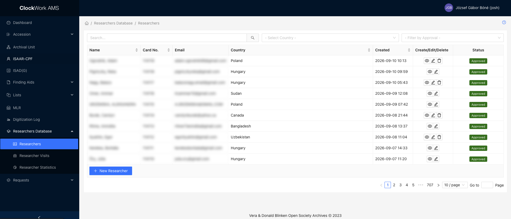
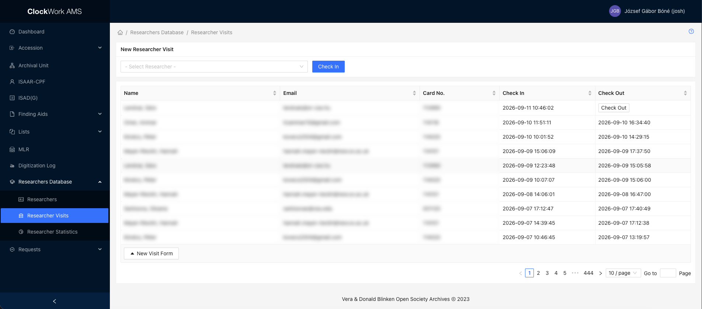
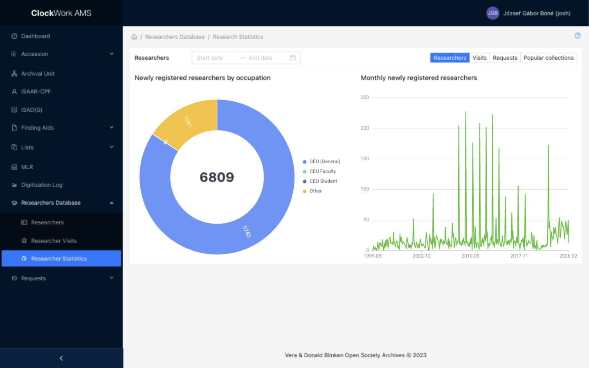

# Researchers Database

The **Researchers Database** contains **Researchers**, **Researcher Visits**, and **Researcher Statistics**. It supports registration approval, researcher administration, Reading Room visits, and service reporting. Access requires the **Research** group.

## Researchers

Researchers normally register through the [Blinken OSA Archival Catalog registration form](https://catalog.archivum.org/registration). The submitted information is saved in AMS and appears in the **Researchers** list with the status New.

*The Researchers List provides search, country and approval filters, record actions, registration-status controls, and pagination. Personal details are blurred in this example.*

### Registration and approval workflow

1. The researcher submits the registration form in the Archival Catalog.
2. AMS creates the researcher record and assigns the next virtual card number. The card number is retained internally while the registration awaits approval.
3. The researcher receives an automated email confirming that the registration was received. The Reference Service Desk receives a separate automated email notifying staff of the new registration.
4. The Reference Service Desk reviews the submitted identity, contact, affiliation, and research information. If anything is incomplete or uncertain, staff should contact the researcher by email or, where available, by phone before approving the registration.
5. When the information has been verified, select the New status badge in the Researchers list and confirm the approval action.
6. The status changes to Approved. AMS sends the researcher an automated approval email containing their virtual card number.

The researcher must keep the virtual card number because it is required when requesting archival materials. A researcher with New or Suspended status is not available in the researcher selection used to create requests; approval is therefore required before the first request can be submitted.

!!! important "Approval sends an email"
    Approving a new researcher immediately sends the registration-approved email to the address stored in the record. Verify the email address and the submitted data before confirming the action.

### Assisted registration in AMS

Reference Service Desk staff can register a new researcher directly in AMS when the person visits the Archives and needs assistance.

1. Search the Researchers list by name to check that a record does not already exist. Also review the displayed email address before creating a duplicate; researcher email addresses must be unique.
2. Select **New Researcher** below the table.
3. Complete the Researcher Form and select **Submit**.
4. Review the saved record and approve it using the New status badge once the information has been checked.

A record created directly in AMS also starts with New status and receives its card number when it is first saved. Creating the record through AMS does not send the two Catalog self-registration emails. The approval action does send the researcher their approval email and virtual card number.

### Researchers List

#### Filters

| Filter | Use |
| --- | --- |
| Search | Searches the researcher's first, middle, and last names. |
| Country | Limits the list to a permanent-address country already used in researcher records. |
| Approval | Limits the list to New, Approved, or Suspended researchers. |

#### Columns

| Column | Description | Sortable |
| --- | --- | --- |
| Name | Researcher's name, displayed as last name followed by first name. | Yes |
| Card No. | Six-digit display of the automatically assigned virtual card number. | Yes |
| Email | Email address used for registration and service notifications. | No |
| Country | Country of the researcher's permanent address. | Yes |
| Created | Date and time on which the researcher record was created. | Yes |
| Create/Edit/Delete | Record actions available for the row. | No |
| Status | Registration state and the related status action. | No |

#### Row actions

| Action | Availability and effect |
| --- | --- |
|  **View** | Opens the Researcher Form without allowing changes. |
|  **Edit** | Opens the Researcher Form for correction or updating. Editing does not by itself approve the researcher. |
|  **Delete** | Appears only when the record is removable. After confirmation, permanently deletes the researcher record. Use **Suspend** instead when the identity and service history must be retained. |
| Select New | After confirmation, changes the status to Approved and emails the virtual card number to the researcher. |
| Select Approved | After confirmation, changes the status to Suspended. The researcher is no longer available for new request selection. No registration email is sent. |
|  **Undo** beside Suspended | After confirmation, reactivates the record and returns it to Approved. No registration email is sent. |

#### Footer action

Select **New Researcher** to open a blank Researcher Form for an assisted, in-person registration.

### Researcher Form

The same form is used to view, create, and edit researcher records. Fields are editable in Create and Edit mode unless noted otherwise.

| Field | Description | Required |
| --- | --- | --- |
| First Name | Researcher's given name. | Yes |
| Middle Name | Researcher's middle name, when applicable. | No |
| Last Name | Researcher's family name. | Yes |
| Country - Permanent Address | Country of permanent residence, selected from the managed [Countries Authority List](../collections-management/lists.md#available-authority-lists). | Yes |
| City | City of the permanent address. | No |
| Address | Street or other address information. | No |
| House No. | House or building number. | No |
| Citizenship | Nationality associated with the researcher. The field is displayed but is not editable in the current AMS form. | No |
| Email | Unique email address used for notifications and communication with the researcher. Check it before approval. | Yes |
| Occupation | Select **CEU Student**, **CEU Faculty**, **CEU**, or **Other**. | Yes |
| Occupation type | Displays the broader category **Student**, **Staff**, or **Faculty**. The field is not editable in the current AMS form. | No |
| Department | Department within the researcher's institution. | No |
| Institution / Position / Independent researcher | Institution, professional position, or indication that the person is an independent researcher. | No |
| Current Degree / Course | Current academic degree or course, selected from the available values. | No |
| How do you know about OSA | Records whether the researcher learned about OSA through its website, an OSA event, Verzio, CEU, personal contacts, media, or another source. | No |
| How do you know about OSA (Other) | Appears when **Other** is selected and records the alternative source. | No |
| Research subject | Brief description of the intended research topic. | No |
| The research will be published | Indicates whether the researcher expects the research to result in a publication. | No |
| Card Number | Automatically assigned virtual research card number. It is displayed as read-only and cannot be entered manually in the form. | Automatic |

Selecting **Submit** creates or updates the record. In View or Edit mode, **Show Info** displays record information and the audit log.

## Record a visit

Use **Researcher Visits** to register and maintain Reading Room visits. Link the correct researcher and record the visit data required by the form and local service procedure.

*The Researcher Visits list combines the new-visit check-in controls with sortable visit history, check-out actions, and pagination. Personal details are blurred in this example.*

## Statistics

**Researcher Statistics** summarizes visits, researchers, requests, and popular collections. Use these figures as operational indicators; confirm reporting definitions before publishing them externally.

*Researcher Statistics presents aggregate operational views.*

Researcher records contain personal data. Access, corrections, exports, and retention must follow institutional data-protection policy.
